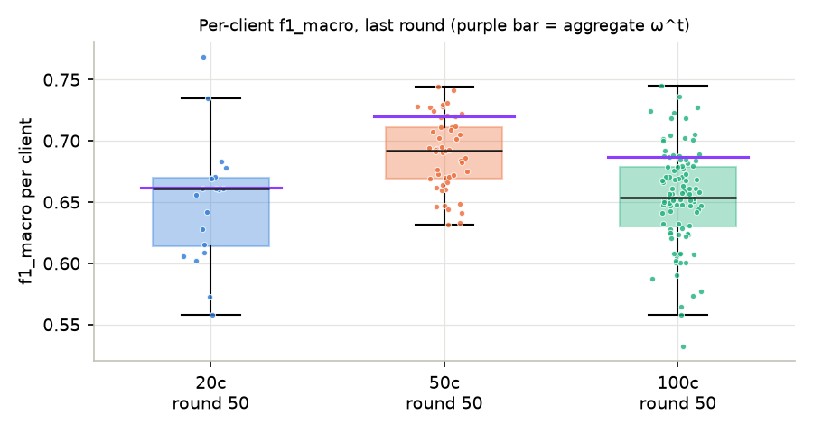
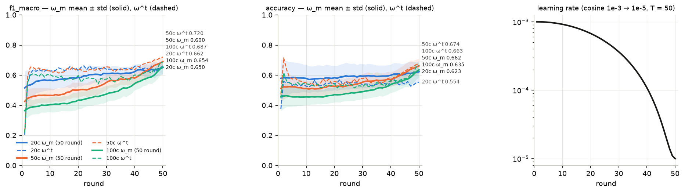
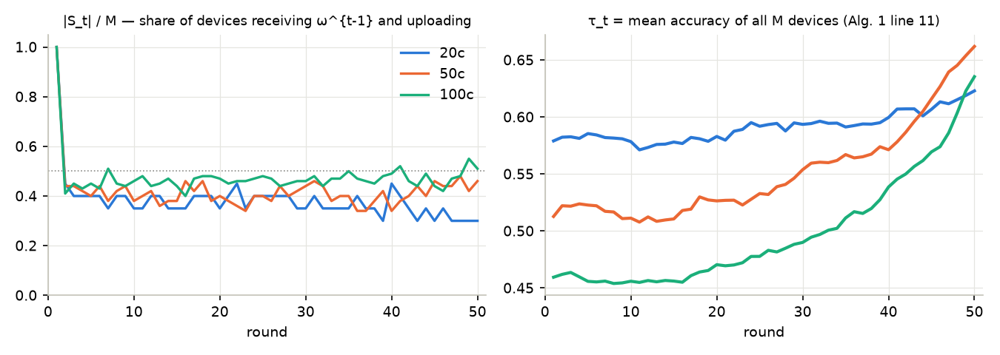
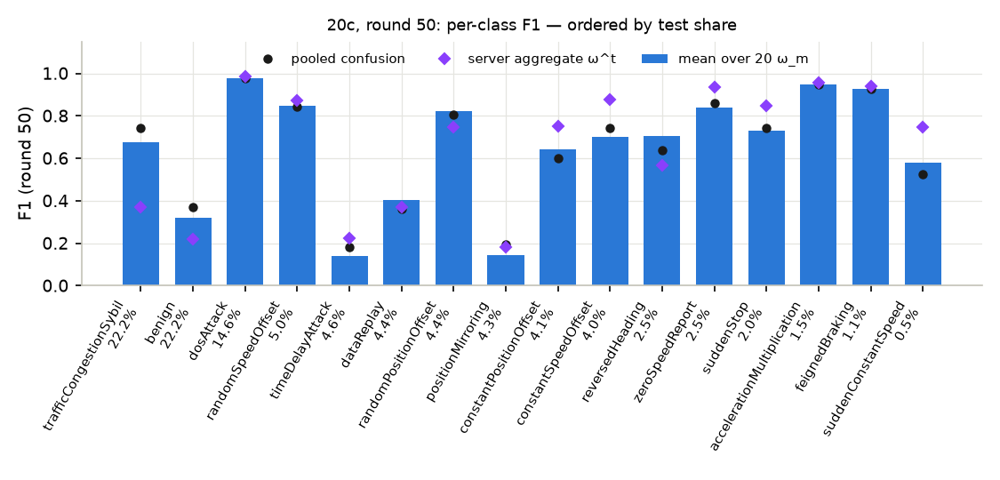
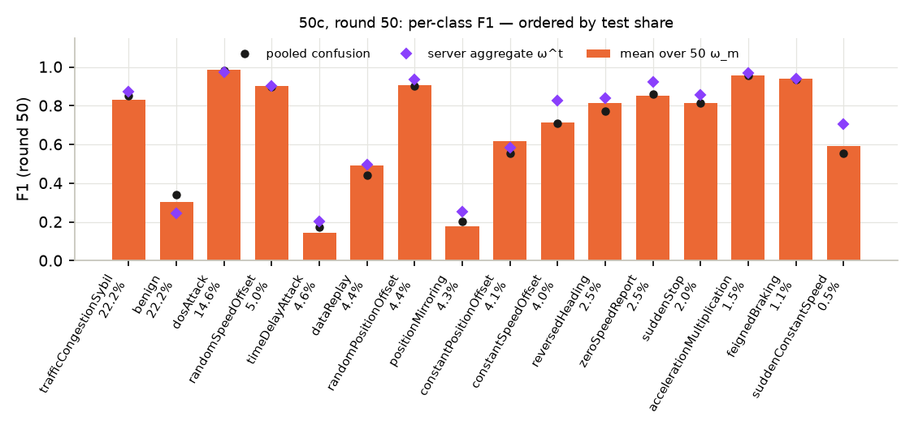
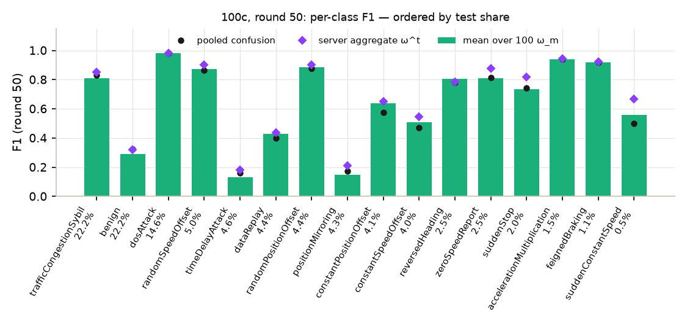
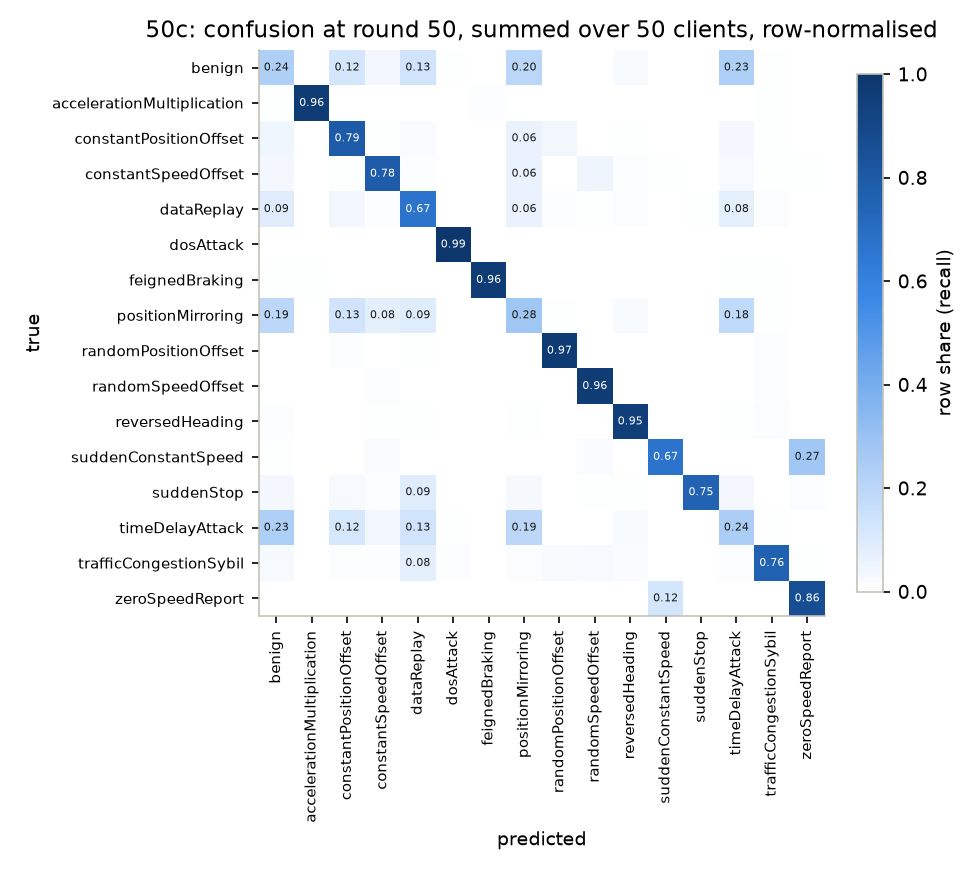
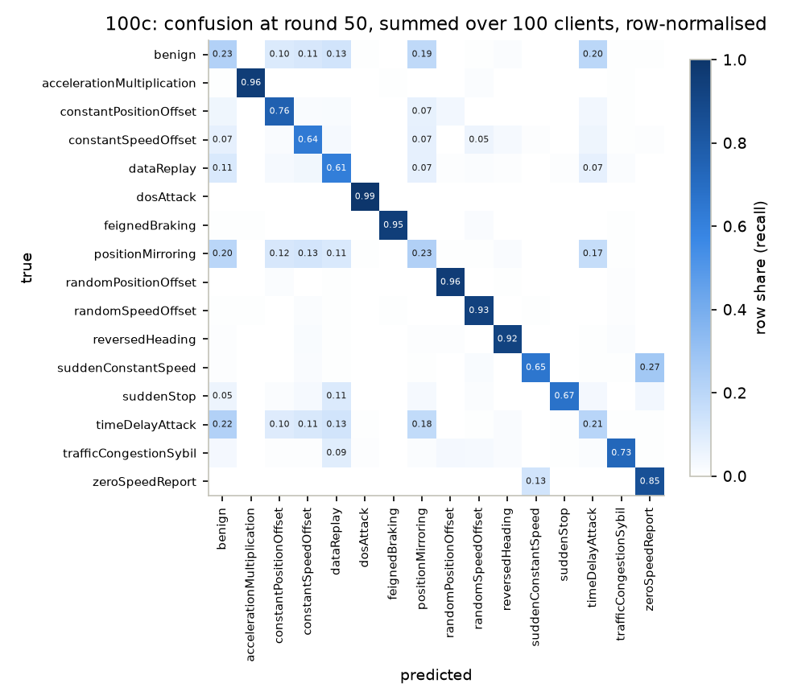
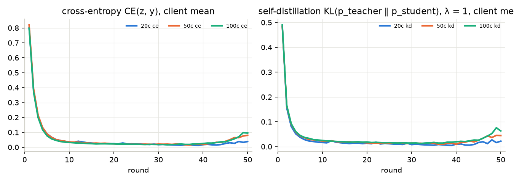
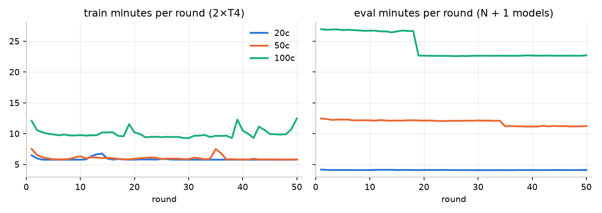

# PerFed-SKD trên VeReMi NextGen / DAGSNet — báo cáo kết quả

Cập nhật 2026-09-23. Cả ba kịch bản đủ 50/50 round. Cây `runs/merged/perfedskd_{20,50,100}c` đều
đã qua `verify_run --require-rounds 50`.

Mọi con số trong báo cáo được đọc từ artifact đã kéo về (`metrics/round_NNN.json`, `history.csv`,
`clients.csv`, `confusion/*.npy`). Không có số nào lấy từ ảnh chụp W&B. Cách đọc từng loại bằng
chứng (local, probe 2×T4, production) được trình bày ở [`tests.md`](tests.md).

---

## 0. Tóm tắt

**ω_m** là M model cá nhân hoá (bảng báo mean trên M). **ω^t** là model tổng hợp ở server. Cả hai
được đo trên **đủ 10.761.343 dòng test toàn cục**, ở round 50.

| kịch bản | round | f1_macro ω_m (mean ± std) | accuracy ω_m | f1_macro ω^t | accuracy ω^t | \|S\|/M (round 2–50) | tiết kiệm truyền tin |
|---|---:|---:|---:|---:|---:|---:|---:|
| 20c | 50/50 | **0,6504** ± 0,0485 | 0,6229 | **0,6616** | 0,5539 | 0,369 | 0,618 |
| 50c | 50/50 | **0,6901** ± 0,0295 | 0,6619 | **0,7202** | 0,6735 | 0,408 | 0,580 |
| 100c | 50/50 | **0,6541** ± 0,0393 | 0,6354 | **0,6871** | 0,6627 | 0,463 | 0,526 |

Sáu điều cần mang theo:

1. **Round cuối là round tốt nhất của ω_m** ở cả ba kịch bản, và f1_macro **vẫn đang tăng** ở
   round 50. Riêng 10 round cuối, khi lr cosine rơi từ 1e-4 xuống 1e-5, f1_macro tăng +0,027
   (20c), +0,109 (50c) và +0,110 (100c) (§4.5).
2. **Trên test toàn cục, model tổng hợp ω^t có f1_macro cao hơn trung bình các model cá nhân hoá**
   ở 47/50 (20c), 49/50 (50c) và 49/50 round (100c). Về **accuracy** thì 20c đi ngược: accuracy
   của ω^t **không round nào** vượt trung bình ω_m, và ở round 50 có 15/20 device vượt ω^t. Ở 50c
   và 100c, ω^t thắng cả hai metric ở hầu hết các round. Quy tắc chọn device của bài báo dùng
   accuracy (§4.4).
3. **Quy tắc τ chọn ít hơn một nửa số device**: |S|/M ≈ 0,37 (20c), 0,41 (50c) và 0,46 (100c),
   không phải 0,5 như đã dự báo, dù M càng lớn thì càng gần 0,5. Truyền tin theo giao thức vì thế
   giảm 53–62 % so với gửi cho mọi device (§4.2).
4. **Device nhiều dữ liệu ít được chọn** (Spearman giữa số dòng và số lần được chọn: −0,76 ở 20c,
   −0,47 ở 50c, −0,43 ở 100c). Ở 20c có 4 device **không bao giờ** được chọn sau round 1. Bốn
   device này thực chất là học cục bộ thuần với self-KD, không nhận thêm gì từ server (§4.2).
5. Được chọn thì có lợi: device được chọn tăng f1_macro trung bình **+0,012** (20c) / **+0,024**
   (50c) / **+0,025** (100c) mỗi round. Device không được chọn giảm **−0,003 / −0,008 / −0,010**
   (§4.3).
6. **Số device không cho thứ tự đơn điệu.** Từ round 1 đến round 40, f1_macro theo đúng thứ tự
   20c > 50c > 100c. Đến round 50 thì 50c (0,690) > 100c (0,654) ≈ 20c (0,650), vì 50c và 100c
   tăng ~0,11 trong 10 round cuối còn 20c chỉ tăng 0,027. Với một seed, chênh 0,004 giữa 100c
   và 20c không phân biệt được với nhiễu (§4.6).

## 1. Cảnh báo phải đọc trước mọi con số

**Đây không phải bản tái lập chính xác của Singh et al.** Hai bên khác nhau ở:

* dữ liệu: VeReMi NextGen 16 lớp, đặc trưng dạng bảng, so với MNIST/EMNIST;
* mô hình: DAGSNet 395.024 tham số;
* ngân sách huấn luyện: 50 round × 1 epoch, so với 200 × 20;
* phân hoạch: Dirichlet α = 0,5, so với 0,001–0,1;
* định nghĩa tập test.

Vì thế **không đặt các con số này cạnh Table III–VI của bài báo**. Cái được kế thừa là
**phương pháp**: Eq. (2), quy tắc chọn device và quy tắc tổng hợp ([`paper.md` §9](paper.md)).

Mọi con số dưới đây phải được trích kèm các deviation D1–D13 ([`rebuild.md` §2](rebuild.md)).
Những điểm ảnh hưởng trực tiếp đến cách đọc:

* **D1: τ là trung bình accuracy của mọi device** (Alg. 1 dòng 11), không phải accuracy của model
  tổng hợp như trong văn xuôi §III-A. Mức tiết kiệm truyền tin đo được ở đây là của định nghĩa
  này. Lý lẽ gốc của D1 cho rằng định nghĩa kia sẽ chọn mọi device. Trên dữ liệu này, điều đó
  **chỉ đúng một phần** (§4.4): nó phụ thuộc vào kịch bản và vào việc so bằng metric nào.
* **D2, D3: a_m là accuracy trên test toàn cục dùng chung.** Điểm số vì thế đo **khả năng tổng quát
  hoá toàn cục** của model cá nhân hoá, không đo hiệu năng trên phân bố cục bộ của device. Bài
  báo gọi con số của nó là "personalized test accuracy". Trên VeReMi không có test chia theo
  client, nên bản dựng này không đo được đại lượng đó.
* **D4: mọi device đều train, chỉ S_t upload.** Tiết kiệm là về **truyền tin**, không phải về tính toán.
* **D5: λ = 1, KL(teacher ‖ student), T = 1.** Không có quét λ.
* **D12: truyền tin được tính theo giao thức** (|S_t| lên + |S_t| xuống), không đo trên mạng.
* **D13: một seed, một lần chạy.** `*_std` là độ lệch **giữa các device**, không phải giữa các lần chạy.
* Caveat của dữ liệu ([`knowledge/dataset.md` §6](../knowledge/dataset.md)):
  * split theo thời gian mô phỏng, test chỉ có scenario `_7`;
  * `scaler.json` fit trên toàn bộ 43 M dòng train (rò rỉ thống kê toàn cục vào FL);
  * rò rỉ Sybil;
  * mất cân bằng 41:1, nên **đọc f1_macro, không đọc accuracy**. Điều này quan trọng gấp đôi
    ở đây, vì quy tắc chọn device lại dùng accuracy;
  * client là receiver unit, không phải xe thật;
  * đặc trưng lưu ở fp16 (D11).

## 2. Thiết lập

| | 20c | 50c | 100c |
|---|---:|---:|---:|
| Tài khoản / kernel | `catbaochau/perfed-skd-veremi-20-clients` | `trietbackup/perfed-skd-veremi-50-clients` → `…-50-clients-s2` | `minhtriethihi/perfed-skd-veremi-100-clients` → `…-100-clients-s2` → `khanhmay0304/perfed-skd-veremi-100-clients-s3` (dataset checkpoint round 38) |
| Phiên (round mỗi phiên) | 1 (50) | 2 (34 + 16) | 3 (18 + 20 + 12) |
| W&B run | `perfedskd_20c` | `perfedskd_50c` | `perfedskd_100c` |
| Batch mỗi device | 512 | 512 | 256 |
| Bước/round (tổng mọi device) | 84.083 | 84.098 | 168.200 |
| Dòng/device (min … max) | 870.217 … 5.890.990 | 199.063 … 2.630.929 | 98.180 … 1.333.839 |
| `data_id` / `content_id` | `29f492a531052d2b` / `3aa70a5c51aacd51` | `c9b541a243f82282` / `fe175b442db619fe` | `4723f6dbf7fa5f2e` / `db2bbb68760a82ee` |
| Fingerprint | `90566629a718b902` | `20ffa11c1e56036c` | `f923c7feb193d427` |

Chung cho cả ba kịch bản ([`rebuild.md` §1](rebuild.md)):

* **Khởi tạo:** một ω^0 duy nhất, seed 42, cho mọi device và cho server.
* **Một round:**
  * teacher V_m = ω_m^{t-1}, đóng băng, chạy ở `eval()` dưới `no_grad`;
  * device thuộc S_t khởi tạo từ ω^{t-1}; device còn lại giữ trọng số riêng của mình;
  * **mọi** device train 1 epoch với φ_m = CE + 1,0 · KL(p_V ‖ p_ω);
  * chỉ S_t upload, server tính ω^t = (1/|S_t|) Σ_{m∈S_t} ω_m;
  * τ_t = (1/M) Σ_m a_m, và S_{t+1} = {m : a_m < τ_t}.
* **Round 1:** S_1 = mọi device, V_m = ω^0.
* **Tối ưu:** AdamW (wd 1e-4) tạo mới mỗi device mỗi round, lr cosine theo round 1e-3 → 1e-5
  (T = 50), clip 1,0, fp16 AMP.
* **Eval mỗi round:** **mọi** M model cá nhân hoá, cộng ω^t, trên đủ tập test. Chính các con số
  này nuôi τ.
* **Môi trường:** torch 2.10.0+cu128, 2 × Tesla T4. Backend `compiled` cho train và eval ở mọi
  round đã chạy.

## 3. Kết quả

### 3.1 Đủ 10 metric ở round 50

Hai cột mỗi kịch bản: mean trên M model cá nhân hoá ω_m, và model tổng hợp ω^t.

| metric | 20c ω_m | 20c ω^t | 50c ω_m | 50c ω^t | 100c ω_m | 100c ω^t |
|---|---:|---:|---:|---:|---:|---:|
| accuracy | 0,6229 | 0,5539 | 0,6619 | 0,6735 | 0,6354 | 0,6627 |
| precision_macro | 0,7022 | 0,6887 | 0,7169 | 0,7198 | 0,6774 | 0,6685 |
| precision_micro | 0,6229 | 0,5539 | 0,6619 | 0,6735 | 0,6354 | 0,6627 |
| precision_weighted | 0,7446 | 0,7268 | 0,7548 | 0,7564 | 0,7228 | 0,7210 |
| recall_macro | 0,7114 | 0,7534 | 0,7391 | 0,7743 | 0,7060 | 0,7492 |
| recall_micro | 0,6229 | 0,5539 | 0,6619 | 0,6735 | 0,6354 | 0,6627 |
| recall_weighted | 0,6229 | 0,5539 | 0,6619 | 0,6735 | 0,6354 | 0,6627 |
| **f1_macro** | **0,6504** | **0,6616** | **0,6901** | **0,7202** | **0,6541** | **0,6871** |
| f1_micro | 0,6229 | 0,5539 | 0,6619 | 0,6735 | 0,6354 | 0,6627 |
| f1_weighted | 0,6077 | 0,5343 | 0,6565 | 0,6658 | 0,6315 | 0,6588 |
| f1_macro std / min / max trên device | 0,0485 / 0,5578 / 0,7689 | — | 0,0295 / 0,6320 / 0,7443 | — | 0,0393 / 0,5323 / 0,7453 | — |

Các metric micro bằng accuracy, như định nghĩa cho bài toán đơn nhãn. Đỉnh f1_macro của ω_m
nằm ở r50 ở cả ba kịch bản. Đỉnh của ω^t: 20c ở r41 (0,6622, chênh r50 0,0006); 50c và 100c ở r50.

### 3.2 Quỹ đạo theo round

| round | lr | 20c f1 ω_m | 20c f1 ω^t | 20c \|S\| | 50c f1 ω_m | 50c f1 ω^t | 50c \|S\| | 100c f1 ω_m | 100c f1 ω^t | 100c \|S\| |
|---:|---:|---:|---:|---:|---:|---:|---:|---:|---:|---:|
| 1 | 1,00e-3 | 0,5153 | 0,2039 | 20 | 0,4256 | 0,2222 | 50 | 0,3652 | 0,2166 | 100 |
| 2 | 9,99e-4 | 0,5309 | 0,5491 | 9 | 0,4456 | 0,5853 | 22 | 0,3771 | 0,5489 | 41 |
| 3 | 9,96e-4 | 0,5352 | 0,6107 | 8 | 0,4531 | 0,6541 | 22 | 0,3863 | 0,5992 | 45 |
| 5 | 9,84e-4 | 0,5593 | 0,6253 | 8 | 0,4623 | 0,6385 | 20 | 0,3912 | 0,6039 | 45 |
| 10 | 9,20e-4 | 0,5671 | 0,6271 | 7 | 0,4660 | 0,6279 | 19 | 0,4045 | 0,6038 | 46 |
| 15 | 8,14e-4 | 0,5756 | 0,6324 | 7 | 0,4749 | 0,6222 | 19 | 0,4128 | 0,5649 | 44 |
| 20 | 6,76e-4 | 0,5845 | 0,6298 | 7 | 0,5014 | 0,6397 | 20 | 0,4339 | 0,5975 | 47 |
| 25 | 5,21e-4 | 0,6038 | 0,6397 | 8 | 0,5162 | 0,6363 | 20 | 0,4524 | 0,5775 | 48 |
| 30 | 3,64e-4 | 0,6103 | 0,6382 | 7 | 0,5523 | 0,6554 | 22 | 0,4745 | 0,5737 | 46 |
| 35 | 2,22e-4 | 0,6092 | 0,6354 | 7 | 0,5746 | 0,6423 | 20 | 0,5050 | 0,5919 | 50 |
| 40 | 1,08e-4 | 0,6233 | 0,6596 | 9 | 0,5807 | 0,6352 | 17 | 0,5444 | 0,6012 | 49 |
| 45 | 3,52e-5 | 0,6308 | 0,6348 | 6 | 0,6389 | 0,6868 | 23 | 0,5847 | 0,6235 | 44 |
| 48 | 1,41e-5 | 0,6404 | 0,6309 | 6 | 0,6721 | 0,7038 | 24 | 0,6215 | 0,6375 | 48 |
| 49 | 1,10e-5 | 0,6446 | 0,6468 | 6 | 0,6804 | 0,7141 | 21 | 0,6415 | 0,6845 | 55 |
| 50 | 1,00e-5 | **0,6504** | **0,6616** | 6 | **0,6901** | **0,7202** | 23 | **0,6541** | **0,6871** | 51 |

Đủ 10 metric, std/min/max, τ, số bước bị skip và thời gian của **mọi** round ở phụ lục A–C.

## 4. Phân tích

### 4.1 Bốn hình dạng dự báo trước khi chạy: cả bốn đều xuất hiện

Bốn dự báo ở [`rebuild.md` §3](rebuild.md) được viết ra **trước** khi có run nào:

| dự báo | 20c | 50c | 100c |
|---|---|---|---|
| `global_*` rất tệ ở round 1, lên từ round 2 | f1 ω^t 0,204 → 0,549 → 0,611 | 0,222 → 0,585 → 0,654 | 0,217 → 0,549 → 0,599 |
| `kd` cao nhất ở round 1 | 0,485 → 0,156 → 0,022 (r50) | 0,485 → 0,165 → 0,045 | 0,490 → 0,166 → 0,063 |
| \|S\| = M ở round 1, rồi quanh M/2 | 20 → 9 → 6–9 | 50 → 22 → 17–24 | 100 → 41 → 40–55 |
| f1_macro ω_m có thể giảm ở vài round | có (vd. r35 < r30, r45 dao động) | có (r36 < r35) | có, ít nhất (5 round: r8, 13, 16, 27, 37) |

Dự báo thứ ba chỉ đúng một nửa: |S| **thấp hơn** M/2 một cách hệ thống, dù khoảng cách hẹp dần khi
M tăng (§4.2).

### 4.2 Quy tắc chọn device: ít hơn một nửa, và thiên về device ít dữ liệu

**|S|/M ≈ 0,37 (20c), 0,41 (50c) và 0,46 (100c)**, ổn định từ round 2 đến round 50. τ là trung
bình, nên |S| < M/2 nghĩa là phân bố accuracy giữa các device có **đuôi dài phía dưới**: một nhóm
nhỏ device rất yếu kéo trung bình xuống dưới trung vị. Đuôi này ngắn dần khi M tăng. Ở 20c, |S|
còn giảm dần về 6/20 ở 10 round cuối, khi accuracy các device hội tụ sát nhau. Ở 100c thì không
có xu hướng đó (trung bình 47,8/100 ở 10 round cuối, dao động 40–55).

**Device nhiều dữ liệu ít được chọn.** Số lần được chọn ở round 2–50 so với số dòng train của
device:

| | 20c | 50c | 100c |
|---|---:|---:|---:|
| Spearman(số dòng, số lần được chọn) | **−0,76** | **−0,47** | **−0,43** |
| số lần được chọn: min / trung vị / max (trên 49 round) | 0 / 4 / 49 | 2 / 9 / 49 | 1 / 11 / 49 |
| device **không bao giờ** được chọn sau round 1 | **4** (trung vị 3,36 M dòng) | 0 | 0 |
| device **luôn** được chọn | 5 (trung vị 1,24 M dòng) | 12 (trung vị 0,50 M dòng) | 24 (trung vị 0,30 M dòng) |
| tỉ lệ được chọn theo tứ phân vị số dòng (nhỏ → lớn) | 0,78 / 0,48 / 0,20 / 0,02 | 0,70 / 0,29 / 0,39 / 0,24 | 0,65 / 0,53 / 0,43 / 0,24 |

Cơ chế: accuracy trên test toàn cục phần lớn do hai lớp lớn quyết định (`benign` và
`trafficCongestionSybil`, 44,5 % tập test). Device có nhiều dữ liệu thấy đủ hai lớp này và đạt
accuracy cao ngay từ đầu, nên nằm trên τ. Hệ quả ở 20c: **4 device lớn nhất rời hẳn khỏi giao
thức liên kết** sau round 1. Chúng chỉ train với self-KD trên dữ liệu của mình và không bao giờ
nhận ω^t. Đến round 50, f1_macro trung bình của nhóm này là 0,635, dưới mức 0,650 của toàn bộ.
5 device luôn được chọn thì gần như chạy FedAvg + SKD. PerFed-SKD như được viết trong Alg. 1 vì
thế **tự chia** tập device thành hai chế độ, và đường ranh giới gần như trùng với kích thước dữ liệu.

Ở 50c và 100c không device nào bị bỏ hẳn, nhưng chiều hướng vẫn vậy: tứ phân vị nhỏ nhất được
chọn ở 65–70 % số round, tứ phân vị lớn nhất chỉ ở ~24 %.

Hệ quả về truyền tin: tính cả round 1 (|S| = M), chi phí giao thức giảm trung bình **61,8 %
(20c), 58,0 % (50c) và 52,6 % (100c)** so với gửi cho mọi device. Tổng lượng lên (bằng lượng
xuống) là 580 MiB (20c), 1.595 MiB (50c) và 3.601 MiB (100c) cho 50 round, với 1,507 MiB mỗi
model. Đây là số **tính** (D12).

### 4.3 Được chọn thì tăng, không được chọn thì trôi xuống nhẹ

Thay đổi metric của một device từ round t−1 sang round t, tách theo việc device có thuộc S_t hay không:

| | 20c: thuộc S_t | 20c: ngoài S_t | 50c: thuộc S_t | 50c: ngoài S_t | 100c: thuộc S_t | 100c: ngoài S_t |
|---|---:|---:|---:|---:|---:|---:|
| Δ accuracy trung bình | **+0,0080** | −0,0033 | **+0,0173** | −0,0068 | **+0,0187** | −0,0095 |
| Δ f1_macro trung bình | **+0,0120** | −0,0027 | **+0,0241** | −0,0075 | **+0,0246** | −0,0103 |
| số cặp (device, round) | 362 | 618 | 1.000 | 1.450 | 2.270 | 2.630 |

Cả hai chiều đều lớn dần theo M. Một cách đọc, chưa được kiểm: M càng lớn thì mỗi device càng ít
dữ liệu, nên nhận ω^{t-1} càng có lợi và tự train một mình càng trôi xa.

Device được chọn nhận ω^{t-1}, và trên test toàn cục thì ω^{t-1} tổng quát hoá tốt hơn model
riêng của nó (§4.4), nên nó tăng. Device không được chọn tiếp tục train trên dữ liệu non-IID của
riêng mình, và điểm trên test toàn cục trôi xuống một chút. Đây đúng là cơ chế bài báo mô tả:
"kéo" device yếu lên bằng model tổng hợp. Phần này không chứng minh device không được chọn tốt
hơn **trên phân bố cục bộ của nó**, vì không có test cục bộ (D3).

Một phần hiệu ứng là **hồi quy về trung bình**: device được chọn chính vì accuracy của nó thấp
hơn τ ở round trước. Tách phần đó ra cần một ablation (§8).

### 4.4 ω^t và ω_m trên test toàn cục: ω^t thắng, trừ accuracy ở 20c

| | 20c | 50c | 100c |
|---|---:|---:|---:|
| số round f1_macro ω^t > f1_macro mean ω_m | **47 / 50** | **49 / 50** | **49 / 50** |
| số round accuracy ω^t > accuracy mean ω_m | **0 / 50** | 44 / 50 | 49 / 50 |
| round 50: số device có f1_macro > ω^t | 7 / 20 | 11 / 50 | 19 / 100 |
| round 50: số device có accuracy > ω^t | **15 / 20** | 21 / 50 | 26 / 100 |

Ở 50c và 100c, ω^t thắng trung bình ω_m ở cả hai metric gần như mọi round. Chỉ ở 20c hai metric
tách nhau. Ở đó, ω^t có f1_macro cao hơn đa số device nhưng accuracy **thấp hơn** 15/20 device. Bảng theo
lớp ở round 50 cho thấy lý do: ω^t bỏ sót nặng hai lớp lớn nhất (recall `benign` 0,135,
`trafficCongestionSybil` 0,227). Đổi lại, nó bắt tốt các lớp tấn công nhỏ, những lớp mà từng
device riêng lẻ thấy quá ít.

| lớp (tỉ lệ test) | F1 mean ω_m | F1 ω^t | recall mean ω_m | recall ω^t |
|---|---:|---:|---:|---:|
| trafficCongestionSybil (22,2 %) | 0,674 | 0,369 | 0,600 | 0,227 |
| benign (22,2 %) | 0,320 | 0,218 | 0,273 | 0,135 |
| timeDelayAttack (4,6 %) | 0,141 | 0,224 | 0,279 | 0,666 |
| positionMirroring (4,3 %) | 0,144 | 0,181 | 0,248 | 0,122 |
| dataReplay (4,4 %) | 0,403 | 0,370 | 0,608 | 0,751 |
| constantSpeedOffset (4,0 %) | 0,702 | 0,877 | 0,724 | 0,945 |
| suddenConstantSpeed (0,5 %) | 0,580 | 0,745 | 0,650 | 0,662 |

Bảng đủ 16 lớp: `report_data/per_class_final_{20,50,100}c.csv`. F1 theo lớp và ma trận nhầm lẫn gộp (tổng confusion của mọi ω_m, chuẩn hoá theo hàng) ở round 50:

Hai hệ quả:

* **Lý lẽ của D1 chỉ đúng một phần.** Áp quy tắc văn xuôi §III-A (chọn device có metric dưới
  metric của ω^t) lên **đúng quỹ đạo đã chạy** cho |S| trung bình ở round 2–50 như bảng dưới.
  Đây là phản thực tế tĩnh: nếu chạy thật với quy tắc đó, quỹ đạo sẽ khác.

  | quy tắc | 20c | 50c | 100c |
  |---|---:|---:|---:|
  | Alg. 1 (bản dựng này): a_m < mean_m a_m | 7,4 / 20 (0,37) | 20,4 / 50 (0,41) | 46,3 / 100 (0,46) |
  | văn xuôi, so **accuracy** với ω^t | **5,2 / 20 (0,26)** | 30,5 / 50 (0,61) | **79,9 / 100 (0,80)** |
  | văn xuôi, so **f1_macro** với ω^t | 13,9 / 20 (0,69) | **47,0 / 50 (0,94)** | 92,1 / 100 (0,92) |

  Với đúng metric bài báo dùng (accuracy), quy tắc văn xuôi ở 20c chọn **ít hơn** Alg. 1. Từ
  50c trở lên thì ngược lại, và M càng lớn nó càng tiến gần "chọn mọi device": 0,61 ở 50c, 0,80
  ở 100c. Lý do là ω^t vượt accuracy trung bình của device gần như mọi round ở hai kịch bản này
  (bảng trên). Khi so bằng f1_macro, quy tắc này đã suy biến gần hết ở 50c và 100c (0,92–0,94).
  Vậy lý lẽ gốc của D1 ("cách kia chọn mọi device") **đúng khi M lớn và sai ở 20c**. D1 vẫn
  đứng được vì một lý do không phụ thuộc kịch bản: chỉ Alg. 1 được viết thành công thức (G1).
  Ablation §8.1 mới trả lời được câu này bằng một run thật, vì đây chỉ là phản thực tế tĩnh.
* **Quy tắc chọn theo accuracy ưu tiên đúng những device yếu ở hai lớp lớn**, không phải yếu ở
  các lớp tấn công hiếm. Đây là hệ quả trực tiếp của D2 trên dữ liệu lệch 41:1.

### 4.5 Tăng mạnh ở cuối khi lr tắt dần

**Ở 50c và 100c, mười round cuối là đoạn 10 round tăng dốc nhất của cả run.** Ở 20c, đoạn dốc
nhất là r1–11 (+0,048), còn 10 round cuối chỉ ngang các đoạn giữa run. Khi lr rơi từ 1,08e-4 (r40)
xuống 1e-5 (r50), f1_macro trung bình của ω_m tăng:

| | 20c | 50c | 100c |
|---|---:|---:|---:|
| f1_macro ω_m r40 → r50 | 0,623 → 0,650 (+0,027) | 0,581 → 0,690 (+0,109) | 0,544 → 0,654 (+0,110) |
| f1_macro ω^t r40 → r50 | 0,660 → 0,662 | 0,635 → 0,720 | 0,601 → 0,687 |
| accuracy ω_m r40 → r50 | 0,600 → 0,623 | 0,571 → 0,662 | 0,539 → 0,635 |

Ở 100c, ω^t gần như đứng yên suốt round 3–40 (0,54–0,61) rồi mới tăng. Hệ quả: **50 round với
lịch cosine này chưa bão hoà**. Tăng T, hoặc giữ lr thấp lâu hơn, nhiều khả năng còn cho thêm
điểm. Đây là suy luận từ độ dốc cuối, không phải điều đã đo. Vì checkpoint cuối cũng là checkpoint
tốt nhất của ω_m ở cả ba kịch bản, con số headline không dính lựa chọn hậu nghiệm.

**Loss huấn luyện của device tăng ở cuối, đúng lúc điểm test tăng.** Trung bình trên device, từ log
từng device (`logs/round_NNN.json`):

| round | 20c ce ± std · kd · gnorm | 50c ce ± std · kd · gnorm | 100c ce ± std · kd · gnorm |
|---:|---|---|---|
| 1 | 0,802 ± 0,057 · 0,485 · 0,50 | 0,821 ± 0,083 · 0,485 · 0,53 | 0,798 ± 0,063 · 0,490 · 0,61 |
| 10 | 0,036 ± 0,013 · 0,017 · 0,36 | 0,036 ± 0,020 · 0,023 · 0,46 | 0,032 ± 0,021 · 0,025 · 0,54 |
| 30 | 0,018 ± 0,013 · 0,008 · 0,31 | 0,022 ± 0,017 · 0,015 · 0,48 | 0,019 ± 0,018 · 0,015 · 0,49 |
| đáy ce | r39: 0,013 · 0,005 · 0,31 | r37: 0,016 · 0,009 · 0,45 | r32: 0,017 · 0,013 · 0,50 |
| 40 | 0,018 ± 0,016 · 0,010 · 0,40 | 0,018 ± 0,017 · 0,010 · 0,52 | 0,026 ± 0,025 · 0,020 · 0,77 |
| 45 | 0,026 ± 0,042 · 0,017 · 0,43 | 0,040 ± 0,040 · 0,026 · 0,99 | 0,037 ± 0,037 · 0,026 · 1,09 |
| 50 | 0,039 ± 0,049 · 0,022 · 0,59 | 0,081 ± 0,066 · 0,045 · 1,59 | 0,096 ± 0,073 · 0,063 · 2,21 |
| r50, ce: thuộc S_t / ngoài S_t | 0,083 / 0,020 | 0,128 / 0,040 | 0,150 / 0,040 |

ce đạt đáy ở r32–39, rồi tăng 3–6 lần đến r50. gnorm tăng 2–4 lần. Mức tăng lớn nhất ở 50c và
100c, cũng là hai kịch bản mà f1_macro tăng mạnh nhất ở cuối. Hiện tượng giống bản dựng anh em
`lwfednids` (REPORT §4.3 của dự án đó), nhưng ở đây có thêm một manh mối: phần tăng **tập trung ở
device thuộc S_t** (hàng cuối bảng). Cách đọc sau là suy luận, không phải điều đã đo trực tiếp:

* Device thuộc S_t bắt đầu epoch từ ω^{t-1}. **Khi lr cao**, nó đi xa khỏi ω^{t-1} để khớp phân
  bố lớp lệch của riêng nó. Loss cục bộ thấp, nhưng các device lệch nhau nên trung bình 1/|S| kém.
* **Khi lr ≈ 1e-5**, nó gần như đứng yên tại ω^{t-1}. Loss cục bộ khi đó xấp xỉ loss của model
  tổng hợp trên dữ liệu lệch của device, nên cao hơn. `kd` cũng cao hơn, vì teacher là model cá
  nhân hoá ω_m^{t-1} của chính nó, khác xa ω^{t-1}. Đổi lại, drift gần bằng 0 nên ω^t tốt lên trên
  test toàn cục, và device được chọn mang ω^t đó sang round sau.
* Device ngoài S_t không nhận ω^{t-1}, nên ce của chúng tăng ít hơn nhiều (0,020–0,040 ở r50).

**Số bước AMP bị skip mỗi round cũng tăng.** Đây là mẫu hình mà [`kaggle.md` §6](kaggle.md) liệt
kê là dấu hiệu dừng, nhưng ở đây không phải hỏng:

| | 20c | 50c | 100c |
|---|---:|---:|---:|
| skip mỗi round: 10 round đầu → 10 round cuối | 4–29 → 23–32 | 0–19 → 20–41 | 2–44 → 71–102 |
| max một round / số bước một round | 32 / 84.083 | 41 / 84.098 | 102 / 168.200 (0,06 %) |
| max một device, một round | 4 | 3 | 4 |
| `nonfinite` trên bước đã áp dụng, mọi device mọi round | 0 | 0 | 0 |

Mỗi device tạo một `GradScaler` mới ở 2¹⁶ mỗi round (`driver.py:303`), nên số bước bị bỏ xấp xỉ
log₂(2¹⁶ / scale chịu được). Gradient lớn hơn ở cuối cần scale nhỏ hơn, nên bị bỏ nhiều bước hơn.
Mức cao nhất vẫn là 4 bước một device một round, thấp hơn nhiều so với trần
`max_skips_per_client = 16`.

### 4.6 Số device: không đơn điệu, và thứ tự do 10 round cuối quyết định

| f1_macro | 20c | 50c | 100c | thứ tự |
|---|---:|---:|---:|---|
| ω_m, r1 | 0,515 | 0,426 | 0,365 | 20c > 50c > 100c |
| ω_m, r20 | 0,585 | 0,501 | 0,434 | 20c > 50c > 100c |
| ω_m, r40 | 0,623 | 0,581 | 0,544 | 20c > 50c > 100c |
| ω_m, **r50** | 0,650 | **0,690** | 0,654 | 50c > 100c ≈ 20c |
| ω^t, r40 | 0,660 | 0,635 | 0,601 | 20c > 50c > 100c |
| ω^t, **r50** | 0,662 | **0,720** | 0,687 | 50c > 100c > 20c |

Suốt 40 round đầu, quan hệ "nhiều device thì khó hơn" đúng như bài báo (MNIST 20 → 80 device:
95,7 → 92,5) và như các bản dựng anh em. 10 round cuối đảo thứ tự: 50c và 100c tăng ~0,11, còn
20c chỉ tăng 0,027. Bảng ở §4.5 cho một phần lời giải thích: phần tăng cuối run đi cùng với việc
device thuộc S_t bám sát ω^{t-1}, và 20c có ít device thuộc S_t nhất (6/20 ở 10 round cuối, với 4
device không bao giờ được chọn). Đây là giả thuyết, chưa có ablation nào kiểm nó.

Cách đọc an toàn:

* **Không** kết luận được chiều của hiệu ứng số device ở round 50. Chênh 100c − 20c là 0,004
  f1_macro ω_m, với **một seed** (D13).
* Thứ tự ở round 50 phụ thuộc mạnh vào lịch lr. Nếu dừng ở r40, kết luận sẽ ngược lại. Mọi so
  sánh giữa các kịch bản của bản dựng này vì thế phải kèm đúng lịch lr và số round.
* `lwfednids` (cùng dữ liệu, cùng DAGSNet, cùng lịch lr) thấy 20c > 50c ≈ 100c ở round 50. Hai bản
  dựng khác nhau ở giao thức, nên không so trực tiếp được con số.

## 5. Hiệu năng và chi phí

### 5.1 Calibration trên 2×T4 (probe)

Nguồn: [`tests.md` §4](tests.md). Cả hai probe báo `compiled/compiled`. Bước SKD compiled đạt
**7,85 ms** (batch 512) và **7,27 ms** (batch 256), so với eager 52,83 và 55,98 ms, tức tăng tốc
**6,73× và 7,70×**. Mức này cao hơn hẳn 2,9× của bước DAGSNet đơn, vì bước SKD có ba graph
(teacher fwd, student fwd, student bwd). Eval compiled-folded đạt ~400 nghìn dòng/s ở batch 16384.

### 5.2 Thời gian round, VRAM, phiên: số đo production

| | 20c | 50c | 100c |
|---|---:|---:|---:|
| khởi động mỗi phiên (s) | 903 | 1.413 (phiên 1) | 2.560 · 709 · ~480 (phiên 1 · 2 · 3) |
| round đầu phiên (s) | 639 | 1.199 | 2.345 · 2.055 · 2.102 |
| round trung vị (s) | 593 | 1.085 | 2.198 · 1.930 · 1.978 (cả run: 1.984) |
| train / eval trung vị (s) | 347 / 246 | 355 / 726 | 585 / 1.359 |
| eval chiếm | 41 % | 67 % | 73 % · 70 % · 69 % |
| Σ `seconds` mọi round (h) | 8,31 | 14,92 | 28,48 |
| VRAM đỉnh train / eval (GiB/GPU) | 7,08 / 7,09 | 7,18 / 7,18 | 7,16 / 7,33 |
| bước AMP bị skip: tổng (max một round) | 1.192 (32) | 943 (41) | 2.523 (102) |

100c chạy nhanh hơn 12 % ở phiên 2 (1.930 so với 2.198 s/round). Toàn bộ chênh lệch nằm ở eval:
1.358 so với 1.600 s, trong khi train giữ ~570–610 s. Phiên 3 chạy trên tài khoản khác
(`khanhmay0304`), nhập round 38 từ dataset checkpoint, và eval lại đúng 1.359 s. Con số này cũng
khớp probe (1.359 s). Vậy phiên 1 mới là phiên lệch, và chênh lệch nhiều khả năng đến từ máy
Kaggle được cấp, không phải từ code: cả ba phiên chạy cùng mã, chỉ khác cờ resume và nguồn
checkpoint. Phiên 3 khởi động nhanh nhất (8,0 phút gồm prepack và compile) và dừng sau r50 ở 6,75 h.

Eval, gồm M + 1 model trên 10,76 M dòng mỗi round, là chi phí lớn nhất ở 50c và 100c. Nó cũng là
lý do 100c cần ba phiên ([`rebuild.md` §4](rebuild.md): gộp nhiều model vào một eval là đòn bẩy
lớn nhất còn lại). Không thể cache confusion của device không đổi trọng số, vì theo D4 mọi device
đều train ở mọi round.

## 6. Tính toàn vẹn của artifact

| kiểm | 20c | 50c | 100c |
|---|---|---|---|
| `verify_run.py --require-rounds 50` trên cây đã merge | **pass** | **pass** | **pass** |
| merge phiên (`merge_sessions.py`: overlap byte-identical, history khớp) | — (1 phiên) | ok (34 + 16) | ok (18 + 20 + 12; phiên 3 nhập round 38 từ dataset checkpoint) |
| backend train / eval, mọi round | compiled / compiled | compiled / compiled | compiled / compiled |
| τ và S_{t+1} dựng lại từ accuracy từng device | khớp 50/50 round | khớp 50/50 round | khớp 50/50 round |

`verify_run.py` dựng lại **mọi** con số từ artifact ([`tests.md` §3.5](tests.md)):

* metric trong json, ma trận nhầm lẫn, `history.csv` và `clients.csv` khớp nhau;
* τ, `selected_next` và chuỗi S_t = S_{t+1} của round trước;
* cờ `selected` trong log từng device;
* LR theo lịch;
* file trọng số dựng lại bằng `build_model(cfg)` với `strict=True`, đúng 395.024 tham số;
* `preds/round_050` dựng lại đúng confusion round 50.

## 7. So với kết luận của bài báo (chỉ so hình dạng)

| bài báo nói | bản dựng này thấy |
|---|---|
| Chọn device theo ngưỡng giảm communication overhead | Đúng **theo Alg. 1** (D1): giảm 53–62 % chi phí giao thức. Theo cách đọc của văn xuôi thì mức giảm tuỳ kịch bản và metric: từ 74 % (20c, accuracy) xuống 20 % (100c, accuracy) và 6–8 % (50c/100c, f1_macro) trên quỹ đạo đã chạy (§4.4) |
| Model cá nhân hoá tốt hơn model toàn cục ở từng device | **Không kiểm được** (D3: không có test cục bộ). Trên test toàn cục thì ngược lại theo f1_macro (§4.4) |
| SKD giữ tri thức lịch sử của device | `kd` giảm từ 0,485–0,490 xuống 0,005–0,013 ở đáy (r32–39), rồi tăng lại 0,02–0,06 ở r50 khi lr tắt (§4.5). Student bám teacher, không phân kỳ. Không có ablation λ = 0 để tách tác dụng (§8) |
| Nhiều device hơn thì khó hơn (MNIST 20 → 80: 95,7 → 92,5) | Đúng ở round 1–40 (20c > 50c > 100c). **Không** đúng ở round 50: 50c > 100c ≈ 20c. Một seed, nên không kết luận được chiều ở round 50 (§4.6) |

## 8. Việc còn mở

1. **Ablation τ = accuracy của model tổng hợp** (văn xuôi §III-A). Phản thực tế ở §4.4 cho thấy
   kết quả **không** hiển nhiên: ở 20c nó chọn ít device hơn Alg. 1, ở 50c và 100c thì nhiều
   hơn (0,61 và 0,80 so với 0,41 và 0,46). Chi phí
   ~2 h GPU ở 20c × 10 round, hoặc ~3 h ở 50c × 10 round.
2. **λ = 0**, tức FedAvg-chọn-device không có SKD, cùng cấu hình. Đây là run duy nhất tách được
   đóng góp của self-KD khỏi đóng góp của quy tắc chọn. Nó cũng tách được phần hồi quy về trung
   bình ở §4.3.
3. Quét λ; baseline Local / FedAvg cùng cấu hình.
4. Dọn probe kernel và dataset checkpoint trên Kaggle. Đây là thao tác xoá ngoài repo, **chủ dự
   án quyết định**.

## 9. Artifact

| đường dẫn | nội dung |
|---|---|
| `papers/perfedskd-singh-2025/runs/merged/perfedskd_<K>c/history.csv` | mỗi round một hàng: 10 metric × mean/std/min/max trên device, 10 metric `global_*`, loss (`loss/ce/kd/gnorm`), \|S\|, τ, `comm_*`, thời gian, skip, VRAM |
| `…/clients.csv` | round × device × 10 metric |
| `…/metrics/round_NNN.json` | hàng history + `clients[]` (có per-class) + `global{}` + `selected`, `selected_next`, `tau` |
| `…/confusion/round_NNN.npy`, `global_NNN.npy` | (M, 16, 16) và (16, 16) int64 trên đủ tập test |
| `…/logs/round_NNN.json` | mỗi device: bước, skip, lr, seed, `selected`, thời gian, VRAM, 4 thành phần loss |
| `…/preds/round_050.u8.npy`, `global_050.u8.npy` | dự đoán round 50 |
| `…/weights/round_NNN.pt` | ω^t + M ω_m + `selected_next` + `tau`, nạp bằng `weights_only=True` → `build_model(cfg)` |
| `…/reports/manifest.json`, `y_true.u8.npy` | cfg, fingerprint, data_id, số dòng từng device, nhãn test |
| `papers/perfedskd-singh-2025/report_data/` | bảng và hình sinh bởi `scripts/report_data.py` (README ở đó) |

---

## Phụ lục: đủ 10 metric ở mọi round

Sinh tự động bởi `scripts/report_data.py --report docs/report.md`. Không sửa tay giữa hai marker.

<!-- APPENDIX:BEGIN -->

### A. 20 client — 50/50 round (chính thức)

| round | lr | accuracy | precision_macro | precision_micro | precision_weighted | recall_macro | recall_micro | recall_weighted | f1_macro | f1_micro | f1_weighted | f1_macro std | min | max | global f1_macro | global acc | |S| | tau | skip | train s | eval s |
|---:|---:|---:|---:|---:|---:|---:|---:|---:|---:|---:|---:|---:|---:|---:|---:|---:|---:|---:|---:|---:|---:|
| 1 | 1.00e-03 | 0.5790 | 0.6190 | 0.5790 | 0.6557 | 0.5705 | 0.5790 | 0.5790 | 0.5153 | 0.5790 | 0.5531 | 0.1100 | 0.2903 | 0.7232 | 0.2039 | 0.3761 | 20 | 0.5790 | 4 | 389 | 250 |
| 2 | 9.99e-04 | 0.5823 | 0.6363 | 0.5823 | 0.6638 | 0.5854 | 0.5823 | 0.5823 | 0.5309 | 0.5823 | 0.5583 | 0.1023 | 0.3145 | 0.7170 | 0.5491 | 0.5584 | 9 | 0.5823 | 10 | 359 | 247 |
| 3 | 9.96e-04 | 0.5826 | 0.6444 | 0.5826 | 0.6684 | 0.5938 | 0.5826 | 0.5826 | 0.5352 | 0.5826 | 0.5581 | 0.0989 | 0.3320 | 0.7244 | 0.6107 | 0.5492 | 8 | 0.5826 | 13 | 347 | 246 |
| 4 | 9.91e-04 | 0.5812 | 0.6615 | 0.5812 | 0.6826 | 0.6011 | 0.5812 | 0.5812 | 0.5441 | 0.5812 | 0.5587 | 0.0925 | 0.3856 | 0.7090 | 0.6357 | 0.5535 | 8 | 0.5812 | 17 | 347 | 246 |
| 5 | 9.84e-04 | 0.5855 | 0.6684 | 0.5855 | 0.6966 | 0.6154 | 0.5855 | 0.5855 | 0.5593 | 0.5855 | 0.5641 | 0.0779 | 0.4235 | 0.7102 | 0.6253 | 0.5310 | 8 | 0.5855 | 18 | 347 | 246 |
| 6 | 9.75e-04 | 0.5843 | 0.6674 | 0.5843 | 0.6961 | 0.6184 | 0.5843 | 0.5843 | 0.5613 | 0.5843 | 0.5628 | 0.0763 | 0.4216 | 0.7057 | 0.6375 | 0.5451 | 8 | 0.5843 | 22 | 347 | 246 |
| 7 | 9.64e-04 | 0.5820 | 0.6674 | 0.5820 | 0.7008 | 0.6233 | 0.5820 | 0.5820 | 0.5660 | 0.5820 | 0.5613 | 0.0750 | 0.4179 | 0.7100 | 0.6286 | 0.5296 | 7 | 0.5820 | 24 | 347 | 246 |
| 8 | 9.51e-04 | 0.5815 | 0.6699 | 0.5815 | 0.7101 | 0.6280 | 0.5815 | 0.5815 | 0.5681 | 0.5815 | 0.5605 | 0.0728 | 0.4266 | 0.6953 | 0.6261 | 0.5292 | 8 | 0.5815 | 29 | 347 | 246 |
| 9 | 9.36e-04 | 0.5809 | 0.6660 | 0.5809 | 0.7099 | 0.6277 | 0.5809 | 0.5809 | 0.5654 | 0.5809 | 0.5596 | 0.0665 | 0.4416 | 0.6834 | 0.6363 | 0.5390 | 8 | 0.5809 | 24 | 347 | 246 |
| 10 | 9.20e-04 | 0.5784 | 0.6662 | 0.5784 | 0.7188 | 0.6294 | 0.5784 | 0.5784 | 0.5671 | 0.5784 | 0.5580 | 0.0661 | 0.4417 | 0.6827 | 0.6271 | 0.5264 | 7 | 0.5784 | 23 | 347 | 246 |
| 11 | 9.02e-04 | 0.5712 | 0.6627 | 0.5712 | 0.7164 | 0.6271 | 0.5712 | 0.5712 | 0.5632 | 0.5712 | 0.5511 | 0.0628 | 0.4393 | 0.6894 | 0.6288 | 0.5224 | 7 | 0.5712 | 25 | 349 | 247 |
| 12 | 8.82e-04 | 0.5733 | 0.6647 | 0.5733 | 0.7204 | 0.6326 | 0.5733 | 0.5733 | 0.5675 | 0.5733 | 0.5530 | 0.0570 | 0.4458 | 0.6790 | 0.6325 | 0.5343 | 8 | 0.5733 | 28 | 379 | 248 |
| 13 | 8.61e-04 | 0.5759 | 0.6643 | 0.5759 | 0.7193 | 0.6366 | 0.5759 | 0.5759 | 0.5713 | 0.5759 | 0.5559 | 0.0563 | 0.4669 | 0.6764 | 0.6489 | 0.5676 | 8 | 0.5759 | 24 | 399 | 248 |
| 14 | 8.38e-04 | 0.5762 | 0.6727 | 0.5762 | 0.7222 | 0.6359 | 0.5762 | 0.5762 | 0.5732 | 0.5762 | 0.5563 | 0.0577 | 0.4613 | 0.6838 | 0.6409 | 0.5303 | 7 | 0.5762 | 25 | 406 | 248 |
| 15 | 8.14e-04 | 0.5780 | 0.6705 | 0.5780 | 0.7221 | 0.6401 | 0.5780 | 0.5780 | 0.5756 | 0.5780 | 0.5588 | 0.0571 | 0.4704 | 0.6856 | 0.6324 | 0.5299 | 7 | 0.5780 | 23 | 357 | 246 |
| 16 | 7.88e-04 | 0.5767 | 0.6716 | 0.5767 | 0.7219 | 0.6389 | 0.5767 | 0.5767 | 0.5750 | 0.5767 | 0.5574 | 0.0537 | 0.4744 | 0.6820 | 0.6341 | 0.5319 | 7 | 0.5767 | 28 | 348 | 246 |
| 17 | 7.62e-04 | 0.5821 | 0.6719 | 0.5821 | 0.7262 | 0.6425 | 0.5821 | 0.5821 | 0.5791 | 0.5821 | 0.5634 | 0.0656 | 0.4579 | 0.6845 | 0.6564 | 0.5481 | 8 | 0.5821 | 24 | 353 | 246 |
| 18 | 7.34e-04 | 0.5809 | 0.6714 | 0.5809 | 0.7241 | 0.6458 | 0.5809 | 0.5809 | 0.5823 | 0.5809 | 0.5616 | 0.0572 | 0.4462 | 0.6794 | 0.6406 | 0.5455 | 8 | 0.5809 | 25 | 348 | 246 |
| 19 | 7.05e-04 | 0.5787 | 0.6723 | 0.5787 | 0.7222 | 0.6453 | 0.5787 | 0.5787 | 0.5798 | 0.5787 | 0.5597 | 0.0660 | 0.4234 | 0.6846 | 0.6493 | 0.5519 | 8 | 0.5787 | 24 | 347 | 245 |
| 20 | 6.76e-04 | 0.5829 | 0.6715 | 0.5829 | 0.7253 | 0.6510 | 0.5829 | 0.5829 | 0.5845 | 0.5829 | 0.5631 | 0.0551 | 0.4806 | 0.6722 | 0.6298 | 0.5423 | 7 | 0.5829 | 26 | 347 | 246 |
| 21 | 6.46e-04 | 0.5797 | 0.6751 | 0.5797 | 0.7238 | 0.6497 | 0.5797 | 0.5797 | 0.5855 | 0.5797 | 0.5614 | 0.0612 | 0.4362 | 0.6752 | 0.6523 | 0.5519 | 8 | 0.5797 | 24 | 349 | 246 |
| 22 | 6.15e-04 | 0.5875 | 0.6809 | 0.5875 | 0.7304 | 0.6599 | 0.5875 | 0.5875 | 0.5956 | 0.5875 | 0.5687 | 0.0619 | 0.4749 | 0.7398 | 0.6620 | 0.5715 | 9 | 0.5875 | 23 | 349 | 246 |
| 23 | 5.84e-04 | 0.5891 | 0.6777 | 0.5891 | 0.7289 | 0.6610 | 0.5891 | 0.5891 | 0.5958 | 0.5891 | 0.5689 | 0.0603 | 0.4740 | 0.7328 | 0.6361 | 0.5329 | 7 | 0.5891 | 25 | 349 | 247 |
| 24 | 5.53e-04 | 0.5951 | 0.6852 | 0.5951 | 0.7325 | 0.6666 | 0.5951 | 0.5951 | 0.6035 | 0.5951 | 0.5754 | 0.0660 | 0.4727 | 0.7315 | 0.6614 | 0.5601 | 8 | 0.5951 | 22 | 347 | 247 |
| 25 | 5.21e-04 | 0.5919 | 0.6832 | 0.5919 | 0.7319 | 0.6693 | 0.5919 | 0.5919 | 0.6038 | 0.5919 | 0.5720 | 0.0579 | 0.4874 | 0.7235 | 0.6397 | 0.5380 | 8 | 0.5919 | 21 | 354 | 245 |
| 26 | 4.89e-04 | 0.5934 | 0.6831 | 0.5934 | 0.7311 | 0.6713 | 0.5934 | 0.5934 | 0.6061 | 0.5934 | 0.5741 | 0.0540 | 0.4952 | 0.7104 | 0.6491 | 0.5537 | 8 | 0.5934 | 27 | 351 | 245 |
| 27 | 4.57e-04 | 0.5944 | 0.6825 | 0.5944 | 0.7305 | 0.6714 | 0.5944 | 0.5944 | 0.6054 | 0.5944 | 0.5741 | 0.0565 | 0.4875 | 0.7097 | 0.6467 | 0.5498 | 8 | 0.5944 | 27 | 347 | 245 |
| 28 | 4.26e-04 | 0.5878 | 0.6742 | 0.5878 | 0.7255 | 0.6688 | 0.5878 | 0.5878 | 0.6005 | 0.5878 | 0.5677 | 0.0577 | 0.4966 | 0.6984 | 0.6440 | 0.5486 | 8 | 0.5878 | 22 | 347 | 245 |
| 29 | 3.95e-04 | 0.5948 | 0.6862 | 0.5948 | 0.7335 | 0.6756 | 0.5948 | 0.5948 | 0.6119 | 0.5948 | 0.5755 | 0.0520 | 0.4939 | 0.7028 | 0.6519 | 0.5472 | 7 | 0.5948 | 22 | 347 | 245 |
| 30 | 3.64e-04 | 0.5935 | 0.6810 | 0.5935 | 0.7304 | 0.6755 | 0.5935 | 0.5935 | 0.6103 | 0.5935 | 0.5739 | 0.0505 | 0.5029 | 0.6919 | 0.6382 | 0.5368 | 7 | 0.5935 | 25 | 347 | 245 |
| 31 | 3.34e-04 | 0.5942 | 0.6822 | 0.5942 | 0.7308 | 0.6756 | 0.5942 | 0.5942 | 0.6109 | 0.5942 | 0.5755 | 0.0464 | 0.5092 | 0.6826 | 0.6406 | 0.5421 | 8 | 0.5942 | 23 | 347 | 245 |
| 32 | 3.05e-04 | 0.5963 | 0.6832 | 0.5963 | 0.7315 | 0.6793 | 0.5963 | 0.5963 | 0.6135 | 0.5963 | 0.5772 | 0.0489 | 0.5136 | 0.6927 | 0.6397 | 0.5396 | 7 | 0.5963 | 27 | 347 | 245 |
| 33 | 2.76e-04 | 0.5945 | 0.6804 | 0.5945 | 0.7298 | 0.6775 | 0.5945 | 0.5945 | 0.6114 | 0.5945 | 0.5745 | 0.0503 | 0.5128 | 0.6880 | 0.6391 | 0.5313 | 7 | 0.5945 | 23 | 347 | 245 |
| 34 | 2.48e-04 | 0.5947 | 0.6804 | 0.5947 | 0.7298 | 0.6797 | 0.5947 | 0.5947 | 0.6127 | 0.5947 | 0.5750 | 0.0471 | 0.5188 | 0.6902 | 0.6376 | 0.5357 | 7 | 0.5947 | 22 | 347 | 245 |
| 35 | 2.22e-04 | 0.5912 | 0.6757 | 0.5912 | 0.7268 | 0.6783 | 0.5912 | 0.5912 | 0.6092 | 0.5912 | 0.5714 | 0.0454 | 0.5135 | 0.6888 | 0.6354 | 0.5389 | 7 | 0.5912 | 24 | 347 | 245 |
| 36 | 1.96e-04 | 0.5925 | 0.6804 | 0.5925 | 0.7306 | 0.6791 | 0.5925 | 0.5925 | 0.6116 | 0.5925 | 0.5732 | 0.0450 | 0.5157 | 0.6827 | 0.6453 | 0.5528 | 8 | 0.5925 | 20 | 347 | 245 |
| 37 | 1.72e-04 | 0.5939 | 0.6815 | 0.5939 | 0.7313 | 0.6810 | 0.5939 | 0.5939 | 0.6138 | 0.5939 | 0.5744 | 0.0434 | 0.5320 | 0.6798 | 0.6417 | 0.5433 | 7 | 0.5939 | 27 | 346 | 245 |
| 38 | 1.49e-04 | 0.5937 | 0.6790 | 0.5937 | 0.7292 | 0.6811 | 0.5937 | 0.5937 | 0.6130 | 0.5937 | 0.5746 | 0.0441 | 0.5355 | 0.6831 | 0.6429 | 0.5443 | 7 | 0.5937 | 26 | 347 | 246 |
| 39 | 1.28e-04 | 0.5950 | 0.6809 | 0.5950 | 0.7311 | 0.6839 | 0.5950 | 0.5950 | 0.6161 | 0.5950 | 0.5760 | 0.0444 | 0.5354 | 0.6884 | 0.6375 | 0.5266 | 6 | 0.5950 | 24 | 347 | 245 |
| 40 | 1.08e-04 | 0.5996 | 0.6851 | 0.5996 | 0.7345 | 0.6908 | 0.5996 | 0.5996 | 0.6233 | 0.5996 | 0.5806 | 0.0464 | 0.5207 | 0.6851 | 0.6596 | 0.5704 | 9 | 0.5996 | 25 | 347 | 245 |
| 41 | 9.01e-05 | 0.6070 | 0.6930 | 0.6070 | 0.7388 | 0.6981 | 0.6070 | 0.6070 | 0.6350 | 0.6070 | 0.5899 | 0.0393 | 0.5469 | 0.6986 | 0.6622 | 0.5737 | 8 | 0.6070 | 27 | 347 | 245 |
| 42 | 7.37e-05 | 0.6071 | 0.6934 | 0.6071 | 0.7385 | 0.6992 | 0.6071 | 0.6071 | 0.6361 | 0.6071 | 0.5901 | 0.0373 | 0.5531 | 0.6812 | 0.6480 | 0.5515 | 7 | 0.6071 | 29 | 346 | 245 |
| 43 | 5.90e-05 | 0.6071 | 0.6917 | 0.6071 | 0.7373 | 0.6981 | 0.6071 | 0.6071 | 0.6347 | 0.6071 | 0.5898 | 0.0364 | 0.5499 | 0.6774 | 0.6423 | 0.5359 | 6 | 0.6071 | 28 | 347 | 245 |
| 44 | 4.62e-05 | 0.6010 | 0.6881 | 0.6010 | 0.7349 | 0.6913 | 0.6010 | 0.6010 | 0.6257 | 0.6010 | 0.5843 | 0.0495 | 0.4749 | 0.6839 | 0.6510 | 0.5499 | 7 | 0.6010 | 30 | 348 | 246 |
| 45 | 3.52e-05 | 0.6068 | 0.6876 | 0.6068 | 0.7352 | 0.6954 | 0.6068 | 0.6068 | 0.6308 | 0.6068 | 0.5899 | 0.0390 | 0.5532 | 0.6876 | 0.6348 | 0.5407 | 6 | 0.6068 | 25 | 347 | 246 |
| 46 | 2.62e-05 | 0.6133 | 0.6938 | 0.6133 | 0.7396 | 0.7034 | 0.6133 | 0.6133 | 0.6391 | 0.6133 | 0.5963 | 0.0440 | 0.5576 | 0.7484 | 0.6605 | 0.5577 | 7 | 0.6133 | 25 | 347 | 246 |
| 47 | 1.91e-05 | 0.6116 | 0.6896 | 0.6116 | 0.7372 | 0.6976 | 0.6116 | 0.6116 | 0.6337 | 0.6116 | 0.5953 | 0.0544 | 0.5180 | 0.7423 | 0.6221 | 0.5272 | 6 | 0.6116 | 23 | 346 | 246 |
| 48 | 1.41e-05 | 0.6152 | 0.6950 | 0.6152 | 0.7405 | 0.7032 | 0.6152 | 0.6152 | 0.6404 | 0.6152 | 0.6000 | 0.0432 | 0.5670 | 0.7418 | 0.6309 | 0.5352 | 6 | 0.6152 | 27 | 347 | 246 |
| 49 | 1.10e-05 | 0.6189 | 0.6968 | 0.6189 | 0.7416 | 0.7066 | 0.6189 | 0.6189 | 0.6446 | 0.6189 | 0.6040 | 0.0392 | 0.5702 | 0.7326 | 0.6468 | 0.5493 | 6 | 0.6189 | 32 | 346 | 246 |
| 50 | 1.00e-05 | 0.6229 | 0.7022 | 0.6229 | 0.7446 | 0.7114 | 0.6229 | 0.6229 | 0.6504 | 0.6229 | 0.6077 | 0.0485 | 0.5578 | 0.7689 | 0.6616 | 0.5539 | 6 | 0.6229 | 31 | 349 | 246 |

### B. 50 client — 50/50 round (chính thức)

| round | lr | accuracy | precision_macro | precision_micro | precision_weighted | recall_macro | recall_micro | recall_weighted | f1_macro | f1_micro | f1_weighted | f1_macro std | min | max | global f1_macro | global acc | |S| | tau | skip | train s | eval s |
|---:|---:|---:|---:|---:|---:|---:|---:|---:|---:|---:|---:|---:|---:|---:|---:|---:|---:|---:|---:|---:|---:|
| 1 | 1.00e-03 | 0.5127 | 0.5302 | 0.5127 | 0.6333 | 0.4852 | 0.5127 | 0.5127 | 0.4256 | 0.5127 | 0.4969 | 0.0754 | 0.2712 | 0.5945 | 0.2222 | 0.4718 | 50 | 0.5127 | 0 | 450 | 748 |
| 2 | 9.99e-04 | 0.5222 | 0.5574 | 0.5222 | 0.6457 | 0.5044 | 0.5222 | 0.5222 | 0.4456 | 0.5222 | 0.5088 | 0.0656 | 0.2964 | 0.5993 | 0.5853 | 0.7150 | 22 | 0.5222 | 3 | 392 | 743 |
| 3 | 9.96e-04 | 0.5218 | 0.5712 | 0.5218 | 0.6491 | 0.5128 | 0.5218 | 0.5218 | 0.4531 | 0.5218 | 0.5087 | 0.0590 | 0.2994 | 0.5919 | 0.6541 | 0.6386 | 22 | 0.5218 | 11 | 370 | 734 |
| 4 | 9.91e-04 | 0.5238 | 0.5809 | 0.5238 | 0.6563 | 0.5208 | 0.5238 | 0.5238 | 0.4599 | 0.5238 | 0.5101 | 0.0551 | 0.3063 | 0.5887 | 0.6504 | 0.5883 | 21 | 0.5238 | 9 | 360 | 737 |
| 5 | 9.84e-04 | 0.5228 | 0.5818 | 0.5228 | 0.6560 | 0.5247 | 0.5228 | 0.5228 | 0.4623 | 0.5228 | 0.5092 | 0.0528 | 0.3176 | 0.5901 | 0.6385 | 0.5744 | 20 | 0.5228 | 13 | 350 | 737 |
| 6 | 9.75e-04 | 0.5221 | 0.5832 | 0.5221 | 0.6623 | 0.5314 | 0.5221 | 0.5221 | 0.4664 | 0.5221 | 0.5083 | 0.0500 | 0.3248 | 0.5767 | 0.6486 | 0.5834 | 22 | 0.5221 | 16 | 350 | 737 |
| 7 | 9.64e-04 | 0.5173 | 0.5860 | 0.5173 | 0.6688 | 0.5322 | 0.5173 | 0.5173 | 0.4661 | 0.5173 | 0.5035 | 0.0486 | 0.3285 | 0.5769 | 0.6345 | 0.5628 | 19 | 0.5173 | 14 | 350 | 729 |
| 8 | 9.51e-04 | 0.5167 | 0.5849 | 0.5167 | 0.6637 | 0.5336 | 0.5167 | 0.5167 | 0.4669 | 0.5167 | 0.5029 | 0.0493 | 0.3200 | 0.5701 | 0.6385 | 0.5605 | 21 | 0.5167 | 19 | 354 | 731 |
| 9 | 9.36e-04 | 0.5109 | 0.5883 | 0.5109 | 0.6693 | 0.5335 | 0.5109 | 0.5109 | 0.4658 | 0.5109 | 0.4970 | 0.0487 | 0.3418 | 0.5558 | 0.6298 | 0.5540 | 22 | 0.5109 | 12 | 369 | 730 |
| 10 | 9.20e-04 | 0.5113 | 0.5848 | 0.5113 | 0.6670 | 0.5356 | 0.5113 | 0.5113 | 0.4660 | 0.5113 | 0.4980 | 0.0463 | 0.3653 | 0.5582 | 0.6279 | 0.5486 | 19 | 0.5113 | 17 | 380 | 729 |
| 11 | 9.02e-04 | 0.5078 | 0.5826 | 0.5078 | 0.6662 | 0.5361 | 0.5078 | 0.5078 | 0.4650 | 0.5078 | 0.4936 | 0.0442 | 0.3572 | 0.5437 | 0.6195 | 0.5363 | 20 | 0.5078 | 16 | 359 | 727 |
| 12 | 8.82e-04 | 0.5124 | 0.5849 | 0.5124 | 0.6672 | 0.5412 | 0.5124 | 0.5124 | 0.4708 | 0.5124 | 0.4981 | 0.0425 | 0.3716 | 0.5648 | 0.6272 | 0.5517 | 21 | 0.5124 | 17 | 371 | 733 |
| 13 | 8.61e-04 | 0.5085 | 0.5818 | 0.5085 | 0.6667 | 0.5401 | 0.5085 | 0.5085 | 0.4669 | 0.5085 | 0.4940 | 0.0443 | 0.3384 | 0.5603 | 0.6144 | 0.5263 | 18 | 0.5085 | 19 | 368 | 728 |
| 14 | 8.38e-04 | 0.5097 | 0.5812 | 0.5097 | 0.6664 | 0.5465 | 0.5097 | 0.5097 | 0.4717 | 0.5097 | 0.4944 | 0.0464 | 0.3483 | 0.5643 | 0.6184 | 0.5335 | 19 | 0.5097 | 18 | 362 | 726 |
| 15 | 8.14e-04 | 0.5106 | 0.5850 | 0.5106 | 0.6678 | 0.5493 | 0.5106 | 0.5106 | 0.4749 | 0.5106 | 0.4946 | 0.0454 | 0.3427 | 0.5537 | 0.6222 | 0.5442 | 19 | 0.5106 | 22 | 365 | 728 |
| 16 | 7.88e-04 | 0.5180 | 0.5909 | 0.5180 | 0.6726 | 0.5590 | 0.5180 | 0.5180 | 0.4862 | 0.5180 | 0.5028 | 0.0447 | 0.3482 | 0.5684 | 0.6439 | 0.5753 | 23 | 0.5180 | 22 | 360 | 726 |
| 17 | 7.62e-04 | 0.5192 | 0.5964 | 0.5192 | 0.6755 | 0.5602 | 0.5192 | 0.5192 | 0.4887 | 0.5192 | 0.5044 | 0.0475 | 0.3852 | 0.6083 | 0.6359 | 0.5550 | 21 | 0.5192 | 16 | 355 | 730 |
| 18 | 7.34e-04 | 0.5299 | 0.6046 | 0.5299 | 0.6804 | 0.5744 | 0.5299 | 0.5299 | 0.5019 | 0.5299 | 0.5147 | 0.0507 | 0.3766 | 0.6069 | 0.6534 | 0.5738 | 23 | 0.5299 | 24 | 350 | 730 |
| 19 | 7.05e-04 | 0.5273 | 0.6009 | 0.5273 | 0.6802 | 0.5748 | 0.5273 | 0.5273 | 0.5006 | 0.5273 | 0.5110 | 0.0484 | 0.3986 | 0.5941 | 0.6354 | 0.5458 | 19 | 0.5273 | 11 | 350 | 728 |
| 20 | 6.76e-04 | 0.5264 | 0.6013 | 0.5264 | 0.6791 | 0.5742 | 0.5264 | 0.5264 | 0.5014 | 0.5264 | 0.5116 | 0.0508 | 0.3777 | 0.5891 | 0.6397 | 0.5589 | 20 | 0.5264 | 14 | 355 | 727 |
| 21 | 6.46e-04 | 0.5269 | 0.5997 | 0.5269 | 0.6777 | 0.5781 | 0.5269 | 0.5269 | 0.5044 | 0.5269 | 0.5114 | 0.0460 | 0.3654 | 0.5910 | 0.6349 | 0.5530 | 19 | 0.5269 | 17 | 361 | 729 |
| 22 | 6.15e-04 | 0.5270 | 0.6006 | 0.5270 | 0.6794 | 0.5795 | 0.5270 | 0.5270 | 0.5043 | 0.5270 | 0.5110 | 0.0418 | 0.4077 | 0.5915 | 0.6257 | 0.5385 | 18 | 0.5270 | 14 | 364 | 725 |
| 23 | 5.84e-04 | 0.5228 | 0.5989 | 0.5228 | 0.6784 | 0.5783 | 0.5228 | 0.5228 | 0.5020 | 0.5228 | 0.5071 | 0.0450 | 0.4127 | 0.5971 | 0.6258 | 0.5345 | 17 | 0.5228 | 12 | 368 | 723 |
| 24 | 5.53e-04 | 0.5278 | 0.6022 | 0.5278 | 0.6804 | 0.5847 | 0.5278 | 0.5278 | 0.5085 | 0.5278 | 0.5118 | 0.0486 | 0.4052 | 0.6451 | 0.6374 | 0.5579 | 20 | 0.5278 | 18 | 366 | 723 |
| 25 | 5.21e-04 | 0.5328 | 0.6040 | 0.5328 | 0.6834 | 0.5939 | 0.5328 | 0.5328 | 0.5162 | 0.5328 | 0.5169 | 0.0490 | 0.4239 | 0.6370 | 0.6363 | 0.5535 | 20 | 0.5328 | 12 | 352 | 726 |
| 26 | 4.89e-04 | 0.5320 | 0.6065 | 0.5320 | 0.6842 | 0.5951 | 0.5320 | 0.5320 | 0.5180 | 0.5320 | 0.5171 | 0.0518 | 0.4116 | 0.6288 | 0.6329 | 0.5461 | 19 | 0.5320 | 12 | 357 | 725 |
| 27 | 4.57e-04 | 0.5389 | 0.6099 | 0.5389 | 0.6859 | 0.6010 | 0.5389 | 0.5389 | 0.5240 | 0.5389 | 0.5223 | 0.0515 | 0.4169 | 0.6216 | 0.6452 | 0.5747 | 22 | 0.5389 | 20 | 356 | 725 |
| 28 | 4.26e-04 | 0.5409 | 0.6152 | 0.5409 | 0.6894 | 0.6080 | 0.5409 | 0.5409 | 0.5314 | 0.5409 | 0.5253 | 0.0523 | 0.4060 | 0.6529 | 0.6308 | 0.5504 | 20 | 0.5409 | 14 | 357 | 727 |
| 29 | 3.95e-04 | 0.5463 | 0.6203 | 0.5463 | 0.6935 | 0.6154 | 0.5463 | 0.5463 | 0.5401 | 0.5463 | 0.5314 | 0.0495 | 0.4021 | 0.6259 | 0.6511 | 0.5796 | 21 | 0.5463 | 18 | 351 | 726 |
| 30 | 3.64e-04 | 0.5538 | 0.6273 | 0.5538 | 0.6980 | 0.6271 | 0.5538 | 0.5538 | 0.5523 | 0.5538 | 0.5392 | 0.0480 | 0.4142 | 0.6454 | 0.6554 | 0.5764 | 22 | 0.5538 | 17 | 352 | 728 |
| 31 | 3.34e-04 | 0.5595 | 0.6327 | 0.5595 | 0.7015 | 0.6362 | 0.5595 | 0.5595 | 0.5618 | 0.5595 | 0.5442 | 0.0437 | 0.4154 | 0.6362 | 0.6533 | 0.5858 | 23 | 0.5595 | 20 | 366 | 726 |
| 32 | 3.05e-04 | 0.5604 | 0.6346 | 0.5604 | 0.7022 | 0.6383 | 0.5604 | 0.5604 | 0.5648 | 0.5604 | 0.5446 | 0.0446 | 0.4205 | 0.6513 | 0.6344 | 0.5645 | 22 | 0.5604 | 20 | 360 | 727 |
| 33 | 2.76e-04 | 0.5599 | 0.6320 | 0.5599 | 0.7011 | 0.6377 | 0.5599 | 0.5599 | 0.5626 | 0.5599 | 0.5438 | 0.0471 | 0.4190 | 0.6452 | 0.6234 | 0.5487 | 19 | 0.5599 | 20 | 350 | 724 |
| 34 | 2.48e-04 | 0.5619 | 0.6318 | 0.5619 | 0.7011 | 0.6407 | 0.5619 | 0.5619 | 0.5655 | 0.5619 | 0.5465 | 0.0409 | 0.4155 | 0.6366 | 0.6387 | 0.5629 | 20 | 0.5619 | 24 | 357 | 726 |
| 35 | 2.22e-04 | 0.5670 | 0.6387 | 0.5670 | 0.7055 | 0.6489 | 0.5670 | 0.5670 | 0.5746 | 0.5670 | 0.5529 | 0.0366 | 0.4932 | 0.6767 | 0.6423 | 0.5695 | 20 | 0.5670 | 16 | 450 | 671 |
| 36 | 1.96e-04 | 0.5641 | 0.6360 | 0.5641 | 0.7048 | 0.6483 | 0.5641 | 0.5641 | 0.5723 | 0.5641 | 0.5500 | 0.0370 | 0.4925 | 0.6784 | 0.6330 | 0.5478 | 17 | 0.5641 | 16 | 409 | 675 |
| 37 | 1.72e-04 | 0.5651 | 0.6358 | 0.5651 | 0.7044 | 0.6489 | 0.5651 | 0.5651 | 0.5730 | 0.5651 | 0.5513 | 0.0395 | 0.4798 | 0.6630 | 0.6352 | 0.5498 | 17 | 0.5651 | 21 | 348 | 672 |
| 38 | 1.49e-04 | 0.5674 | 0.6371 | 0.5674 | 0.7063 | 0.6516 | 0.5674 | 0.5674 | 0.5759 | 0.5674 | 0.5535 | 0.0414 | 0.4977 | 0.6696 | 0.6379 | 0.5593 | 19 | 0.5674 | 21 | 352 | 671 |
| 39 | 1.28e-04 | 0.5739 | 0.6419 | 0.5739 | 0.7085 | 0.6595 | 0.5739 | 0.5739 | 0.5854 | 0.5739 | 0.5607 | 0.0437 | 0.5001 | 0.6630 | 0.6497 | 0.5795 | 21 | 0.5739 | 24 | 348 | 669 |
| 40 | 1.08e-04 | 0.5713 | 0.6395 | 0.5713 | 0.7074 | 0.6574 | 0.5713 | 0.5713 | 0.5807 | 0.5713 | 0.5574 | 0.0440 | 0.4988 | 0.6718 | 0.6352 | 0.5552 | 17 | 0.5713 | 15 | 348 | 670 |
| 41 | 9.01e-05 | 0.5782 | 0.6424 | 0.5782 | 0.7091 | 0.6649 | 0.5782 | 0.5782 | 0.5904 | 0.5782 | 0.5650 | 0.0445 | 0.5017 | 0.6885 | 0.6577 | 0.5855 | 19 | 0.5782 | 27 | 348 | 669 |
| 42 | 7.37e-05 | 0.5866 | 0.6529 | 0.5866 | 0.7150 | 0.6742 | 0.5866 | 0.5866 | 0.6024 | 0.5866 | 0.5743 | 0.0477 | 0.4902 | 0.6951 | 0.6603 | 0.5872 | 20 | 0.5866 | 20 | 356 | 677 |
| 43 | 5.90e-05 | 0.5962 | 0.6612 | 0.5962 | 0.7203 | 0.6867 | 0.5962 | 0.5962 | 0.6170 | 0.5962 | 0.5841 | 0.0491 | 0.4818 | 0.7023 | 0.6734 | 0.6091 | 22 | 0.5962 | 29 | 348 | 671 |
| 44 | 4.62e-05 | 0.6049 | 0.6708 | 0.6049 | 0.7263 | 0.6944 | 0.6049 | 0.6049 | 0.6280 | 0.6049 | 0.5945 | 0.0457 | 0.4929 | 0.7107 | 0.6776 | 0.6144 | 20 | 0.6049 | 27 | 348 | 676 |
| 45 | 3.52e-05 | 0.6159 | 0.6788 | 0.6159 | 0.7309 | 0.7031 | 0.6159 | 0.6159 | 0.6389 | 0.6159 | 0.6056 | 0.0460 | 0.4930 | 0.7335 | 0.6868 | 0.6262 | 23 | 0.6159 | 28 | 348 | 673 |
| 46 | 2.62e-05 | 0.6267 | 0.6863 | 0.6267 | 0.7360 | 0.7127 | 0.6267 | 0.6267 | 0.6512 | 0.6267 | 0.6171 | 0.0400 | 0.4933 | 0.7394 | 0.6868 | 0.6391 | 22 | 0.6267 | 29 | 348 | 674 |
| 47 | 1.91e-05 | 0.6395 | 0.6975 | 0.6395 | 0.7423 | 0.7219 | 0.6395 | 0.6395 | 0.6654 | 0.6395 | 0.6309 | 0.0373 | 0.6050 | 0.7654 | 0.7017 | 0.6497 | 22 | 0.6395 | 41 | 348 | 670 |
| 48 | 1.41e-05 | 0.6453 | 0.7029 | 0.6453 | 0.7458 | 0.7263 | 0.6453 | 0.6453 | 0.6721 | 0.6453 | 0.6383 | 0.0349 | 0.6031 | 0.7553 | 0.7038 | 0.6552 | 24 | 0.6453 | 34 | 348 | 670 |
| 49 | 1.10e-05 | 0.6538 | 0.7098 | 0.6538 | 0.7500 | 0.7315 | 0.6538 | 0.6538 | 0.6804 | 0.6538 | 0.6478 | 0.0332 | 0.6178 | 0.7552 | 0.7141 | 0.6712 | 21 | 0.6538 | 27 | 348 | 672 |
| 50 | 1.00e-05 | 0.6619 | 0.7169 | 0.6619 | 0.7548 | 0.7391 | 0.6619 | 0.6619 | 0.6901 | 0.6619 | 0.6565 | 0.0295 | 0.6320 | 0.7443 | 0.7202 | 0.6735 | 23 | 0.6619 | 37 | 348 | 674 |

### C. 100 client — 50/50 round (chính thức)

| round | lr | accuracy | precision_macro | precision_micro | precision_weighted | recall_macro | recall_micro | recall_weighted | f1_macro | f1_micro | f1_weighted | f1_macro std | min | max | global f1_macro | global acc | |S| | tau | skip | train s | eval s |
|---:|---:|---:|---:|---:|---:|---:|---:|---:|---:|---:|---:|---:|---:|---:|---:|---:|---:|---:|---:|---:|---:|
| 1 | 1.00e-03 | 0.4594 | 0.4736 | 0.4594 | 0.6015 | 0.4303 | 0.4594 | 0.4594 | 0.3652 | 0.4594 | 0.4429 | 0.0657 | 0.1749 | 0.4854 | 0.2166 | 0.4464 | 100 | 0.4594 | 2 | 725 | 1617 |
| 2 | 9.99e-04 | 0.4620 | 0.4909 | 0.4620 | 0.6100 | 0.4437 | 0.4620 | 0.4620 | 0.3771 | 0.4620 | 0.4471 | 0.0585 | 0.1920 | 0.4888 | 0.5489 | 0.6161 | 41 | 0.4620 | 7 | 634 | 1612 |
| 3 | 9.96e-04 | 0.4636 | 0.5020 | 0.4636 | 0.6155 | 0.4540 | 0.4636 | 0.4636 | 0.3863 | 0.4636 | 0.4494 | 0.0530 | 0.2186 | 0.4959 | 0.5992 | 0.5626 | 45 | 0.4636 | 20 | 613 | 1614 |
| 4 | 9.91e-04 | 0.4598 | 0.5080 | 0.4598 | 0.6163 | 0.4586 | 0.4598 | 0.4598 | 0.3895 | 0.4598 | 0.4460 | 0.0490 | 0.2255 | 0.4900 | 0.6101 | 0.5486 | 43 | 0.4598 | 27 | 599 | 1615 |
| 5 | 9.84e-04 | 0.4558 | 0.5101 | 0.4558 | 0.6147 | 0.4623 | 0.4558 | 0.4558 | 0.3912 | 0.4558 | 0.4423 | 0.0504 | 0.2562 | 0.5076 | 0.6039 | 0.5406 | 45 | 0.4558 | 30 | 593 | 1608 |
| 6 | 9.75e-04 | 0.4553 | 0.5116 | 0.4553 | 0.6160 | 0.4651 | 0.4553 | 0.4553 | 0.3937 | 0.4553 | 0.4417 | 0.0506 | 0.2783 | 0.5289 | 0.5910 | 0.5339 | 43 | 0.4553 | 33 | 584 | 1612 |
| 7 | 9.64e-04 | 0.4561 | 0.5179 | 0.4561 | 0.6199 | 0.4730 | 0.4561 | 0.4561 | 0.4011 | 0.4561 | 0.4414 | 0.0479 | 0.2843 | 0.5079 | 0.6123 | 0.5513 | 51 | 0.4561 | 44 | 591 | 1608 |
| 8 | 9.51e-04 | 0.4540 | 0.5123 | 0.4540 | 0.6167 | 0.4740 | 0.4540 | 0.4540 | 0.3992 | 0.4540 | 0.4400 | 0.0474 | 0.2864 | 0.4757 | 0.5867 | 0.5335 | 45 | 0.4540 | 42 | 583 | 1605 |
| 9 | 9.36e-04 | 0.4545 | 0.5156 | 0.4545 | 0.6172 | 0.4750 | 0.4545 | 0.4545 | 0.4010 | 0.4545 | 0.4409 | 0.0465 | 0.2806 | 0.4948 | 0.6055 | 0.5458 | 44 | 0.4545 | 36 | 582 | 1601 |
| 10 | 9.20e-04 | 0.4559 | 0.5158 | 0.4559 | 0.6187 | 0.4798 | 0.4559 | 0.4559 | 0.4045 | 0.4559 | 0.4416 | 0.0490 | 0.2900 | 0.5181 | 0.6038 | 0.5424 | 46 | 0.4559 | 40 | 586 | 1603 |
| 11 | 9.02e-04 | 0.4549 | 0.5164 | 0.4549 | 0.6185 | 0.4811 | 0.4549 | 0.4549 | 0.4059 | 0.4549 | 0.4412 | 0.0530 | 0.2685 | 0.5112 | 0.5927 | 0.5392 | 48 | 0.4549 | 48 | 581 | 1602 |
| 12 | 8.82e-04 | 0.4565 | 0.5186 | 0.4565 | 0.6232 | 0.4833 | 0.4565 | 0.4565 | 0.4078 | 0.4565 | 0.4425 | 0.0524 | 0.2925 | 0.5380 | 0.5896 | 0.5313 | 44 | 0.4565 | 45 | 584 | 1596 |
| 13 | 8.61e-04 | 0.4554 | 0.5189 | 0.4554 | 0.6232 | 0.4834 | 0.4554 | 0.4554 | 0.4065 | 0.4554 | 0.4412 | 0.0493 | 0.2905 | 0.5120 | 0.5853 | 0.5287 | 45 | 0.4554 | 34 | 584 | 1596 |
| 14 | 8.38e-04 | 0.4566 | 0.5182 | 0.4566 | 0.6258 | 0.4891 | 0.4566 | 0.4566 | 0.4112 | 0.4566 | 0.4434 | 0.0474 | 0.2982 | 0.5310 | 0.5941 | 0.5413 | 47 | 0.4566 | 46 | 611 | 1586 |
| 15 | 8.14e-04 | 0.4561 | 0.5200 | 0.4561 | 0.6228 | 0.4911 | 0.4561 | 0.4561 | 0.4128 | 0.4561 | 0.4421 | 0.0501 | 0.2921 | 0.5473 | 0.5649 | 0.5170 | 44 | 0.4561 | 41 | 612 | 1596 |
| 16 | 7.88e-04 | 0.4551 | 0.5175 | 0.4551 | 0.6228 | 0.4892 | 0.4551 | 0.4551 | 0.4102 | 0.4551 | 0.4397 | 0.0489 | 0.2851 | 0.5191 | 0.5740 | 0.5182 | 40 | 0.4551 | 38 | 613 | 1604 |
| 17 | 7.62e-04 | 0.4608 | 0.5199 | 0.4608 | 0.6261 | 0.4952 | 0.4608 | 0.4608 | 0.4158 | 0.4608 | 0.4450 | 0.0540 | 0.2722 | 0.5618 | 0.5847 | 0.5344 | 47 | 0.4608 | 48 | 578 | 1600 |
| 18 | 7.34e-04 | 0.4640 | 0.5247 | 0.4640 | 0.6275 | 0.5019 | 0.4640 | 0.4640 | 0.4232 | 0.4640 | 0.4485 | 0.0587 | 0.2858 | 0.5813 | 0.5721 | 0.5276 | 48 | 0.4640 | 43 | 575 | 1600 |
| 19 | 7.05e-04 | 0.4654 | 0.5257 | 0.4654 | 0.6283 | 0.5031 | 0.4654 | 0.4654 | 0.4248 | 0.4654 | 0.4503 | 0.0592 | 0.2860 | 0.5562 | 0.5772 | 0.5309 | 48 | 0.4654 | 41 | 692 | 1360 |
| 20 | 6.76e-04 | 0.4705 | 0.5317 | 0.4705 | 0.6323 | 0.5116 | 0.4705 | 0.4705 | 0.4339 | 0.4705 | 0.4556 | 0.0576 | 0.2921 | 0.5421 | 0.5975 | 0.5442 | 47 | 0.4705 | 45 | 611 | 1359 |
| 21 | 6.46e-04 | 0.4695 | 0.5333 | 0.4695 | 0.6340 | 0.5126 | 0.4695 | 0.4695 | 0.4342 | 0.4695 | 0.4546 | 0.0579 | 0.2871 | 0.5632 | 0.5533 | 0.5152 | 45 | 0.4695 | 43 | 597 | 1358 |
| 22 | 6.15e-04 | 0.4702 | 0.5394 | 0.4702 | 0.6371 | 0.5172 | 0.4702 | 0.4702 | 0.4393 | 0.4702 | 0.4559 | 0.0525 | 0.2879 | 0.5594 | 0.5750 | 0.5351 | 46 | 0.4702 | 43 | 565 | 1358 |
| 23 | 5.84e-04 | 0.4722 | 0.5410 | 0.4722 | 0.6371 | 0.5222 | 0.4722 | 0.4722 | 0.4439 | 0.4722 | 0.4579 | 0.0500 | 0.2913 | 0.5665 | 0.5796 | 0.5307 | 46 | 0.4722 | 33 | 568 | 1357 |
| 24 | 5.53e-04 | 0.4777 | 0.5445 | 0.4777 | 0.6401 | 0.5281 | 0.4777 | 0.4777 | 0.4491 | 0.4777 | 0.4625 | 0.0529 | 0.2928 | 0.5720 | 0.5833 | 0.5361 | 47 | 0.4777 | 43 | 570 | 1357 |
| 25 | 5.21e-04 | 0.4777 | 0.5423 | 0.4777 | 0.6400 | 0.5323 | 0.4777 | 0.4777 | 0.4524 | 0.4777 | 0.4624 | 0.0545 | 0.2911 | 0.5678 | 0.5775 | 0.5299 | 48 | 0.4777 | 54 | 566 | 1356 |
| 26 | 4.89e-04 | 0.4831 | 0.5463 | 0.4831 | 0.6418 | 0.5386 | 0.4831 | 0.4831 | 0.4594 | 0.4831 | 0.4676 | 0.0551 | 0.2898 | 0.6000 | 0.5784 | 0.5406 | 47 | 0.4831 | 48 | 569 | 1355 |
| 27 | 4.57e-04 | 0.4816 | 0.5478 | 0.4816 | 0.6421 | 0.5374 | 0.4816 | 0.4816 | 0.4580 | 0.4816 | 0.4666 | 0.0533 | 0.3469 | 0.5748 | 0.5406 | 0.5150 | 44 | 0.4816 | 45 | 568 | 1357 |
| 28 | 4.26e-04 | 0.4849 | 0.5511 | 0.4849 | 0.6443 | 0.5447 | 0.4849 | 0.4849 | 0.4635 | 0.4849 | 0.4691 | 0.0513 | 0.3398 | 0.5782 | 0.5793 | 0.5263 | 45 | 0.4849 | 46 | 569 | 1356 |
| 29 | 3.95e-04 | 0.4883 | 0.5540 | 0.4883 | 0.6469 | 0.5504 | 0.4883 | 0.4883 | 0.4689 | 0.4883 | 0.4719 | 0.0564 | 0.3357 | 0.5963 | 0.5716 | 0.5296 | 46 | 0.4883 | 42 | 558 | 1358 |
| 30 | 3.64e-04 | 0.4900 | 0.5564 | 0.4900 | 0.6482 | 0.5555 | 0.4900 | 0.4900 | 0.4745 | 0.4900 | 0.4738 | 0.0534 | 0.3407 | 0.5865 | 0.5737 | 0.5236 | 46 | 0.4900 | 51 | 556 | 1359 |
| 31 | 3.34e-04 | 0.4946 | 0.5596 | 0.4946 | 0.6495 | 0.5628 | 0.4946 | 0.4946 | 0.4821 | 0.4946 | 0.4787 | 0.0520 | 0.3359 | 0.6042 | 0.5868 | 0.5411 | 48 | 0.4946 | 53 | 579 | 1359 |
| 32 | 3.05e-04 | 0.4969 | 0.5622 | 0.4969 | 0.6518 | 0.5644 | 0.4969 | 0.4969 | 0.4838 | 0.4969 | 0.4813 | 0.0524 | 0.3401 | 0.5878 | 0.5633 | 0.5237 | 44 | 0.4969 | 44 | 582 | 1359 |
| 33 | 2.76e-04 | 0.5007 | 0.5660 | 0.5007 | 0.6539 | 0.5712 | 0.5007 | 0.5007 | 0.4896 | 0.5007 | 0.4848 | 0.0562 | 0.3440 | 0.5952 | 0.5544 | 0.5269 | 47 | 0.5007 | 46 | 587 | 1359 |
| 34 | 2.48e-04 | 0.5024 | 0.5677 | 0.5024 | 0.6542 | 0.5737 | 0.5024 | 0.5024 | 0.4924 | 0.5024 | 0.4862 | 0.0515 | 0.3385 | 0.5958 | 0.5714 | 0.5293 | 47 | 0.5024 | 49 | 567 | 1359 |
| 35 | 2.22e-04 | 0.5114 | 0.5750 | 0.5114 | 0.6591 | 0.5857 | 0.5114 | 0.5114 | 0.5050 | 0.5114 | 0.4949 | 0.0580 | 0.3285 | 0.6537 | 0.5919 | 0.5507 | 50 | 0.5114 | 67 | 579 | 1359 |
| 36 | 1.96e-04 | 0.5169 | 0.5816 | 0.5169 | 0.6646 | 0.5961 | 0.5169 | 0.5169 | 0.5154 | 0.5169 | 0.5016 | 0.0552 | 0.3571 | 0.6512 | 0.5836 | 0.5446 | 47 | 0.5169 | 55 | 578 | 1359 |
| 37 | 1.72e-04 | 0.5154 | 0.5799 | 0.5154 | 0.6635 | 0.5937 | 0.5154 | 0.5154 | 0.5131 | 0.5154 | 0.4999 | 0.0580 | 0.3517 | 0.6274 | 0.5757 | 0.5363 | 46 | 0.5154 | 56 | 580 | 1358 |
| 38 | 1.49e-04 | 0.5197 | 0.5819 | 0.5197 | 0.6642 | 0.6004 | 0.5197 | 0.5197 | 0.5193 | 0.5197 | 0.5043 | 0.0528 | 0.3498 | 0.6387 | 0.5622 | 0.5296 | 45 | 0.5197 | 59 | 557 | 1359 |
| 39 | 1.28e-04 | 0.5275 | 0.5880 | 0.5275 | 0.6687 | 0.6098 | 0.5275 | 0.5275 | 0.5294 | 0.5275 | 0.5124 | 0.0511 | 0.3535 | 0.6339 | 0.5879 | 0.5547 | 48 | 0.5275 | 59 | 736 | 1362 |
| 40 | 1.08e-04 | 0.5386 | 0.5978 | 0.5386 | 0.6752 | 0.6241 | 0.5386 | 0.5386 | 0.5444 | 0.5386 | 0.5241 | 0.0446 | 0.4449 | 0.6462 | 0.6012 | 0.5610 | 49 | 0.5386 | 66 | 630 | 1361 |
| 41 | 9.01e-05 | 0.5455 | 0.6043 | 0.5455 | 0.6795 | 0.6330 | 0.5455 | 0.5455 | 0.5545 | 0.5455 | 0.5317 | 0.0476 | 0.4529 | 0.6679 | 0.5994 | 0.5662 | 52 | 0.5455 | 78 | 599 | 1359 |
| 42 | 7.37e-05 | 0.5500 | 0.6088 | 0.5500 | 0.6822 | 0.6387 | 0.5500 | 0.5500 | 0.5605 | 0.5500 | 0.5366 | 0.0465 | 0.4262 | 0.6546 | 0.6009 | 0.5622 | 46 | 0.5500 | 74 | 558 | 1360 |
| 43 | 5.90e-05 | 0.5567 | 0.6159 | 0.5567 | 0.6855 | 0.6451 | 0.5567 | 0.5567 | 0.5701 | 0.5567 | 0.5444 | 0.0427 | 0.4788 | 0.6661 | 0.6109 | 0.5645 | 44 | 0.5567 | 72 | 668 | 1360 |
| 44 | 4.62e-05 | 0.5617 | 0.6194 | 0.5617 | 0.6878 | 0.6506 | 0.5617 | 0.5617 | 0.5765 | 0.5617 | 0.5505 | 0.0451 | 0.4181 | 0.6873 | 0.6200 | 0.5731 | 49 | 0.5617 | 74 | 636 | 1359 |
| 45 | 3.52e-05 | 0.5694 | 0.6244 | 0.5694 | 0.6916 | 0.6574 | 0.5694 | 0.5694 | 0.5847 | 0.5694 | 0.5589 | 0.0395 | 0.4865 | 0.6892 | 0.6235 | 0.5794 | 44 | 0.5694 | 76 | 597 | 1359 |
| 46 | 2.62e-05 | 0.5739 | 0.6276 | 0.5739 | 0.6929 | 0.6603 | 0.5739 | 0.5739 | 0.5888 | 0.5739 | 0.5639 | 0.0457 | 0.4599 | 0.7327 | 0.6149 | 0.5794 | 42 | 0.5739 | 71 | 594 | 1359 |
| 47 | 1.91e-05 | 0.5861 | 0.6363 | 0.5861 | 0.6986 | 0.6697 | 0.5861 | 0.5861 | 0.6017 | 0.5861 | 0.5780 | 0.0462 | 0.4941 | 0.7224 | 0.6443 | 0.6053 | 47 | 0.5861 | 81 | 591 | 1359 |
| 48 | 1.41e-05 | 0.6037 | 0.6515 | 0.6037 | 0.7074 | 0.6833 | 0.6037 | 0.6037 | 0.6215 | 0.6037 | 0.5975 | 0.0479 | 0.4461 | 0.7440 | 0.6375 | 0.6158 | 48 | 0.6037 | 89 | 595 | 1359 |
| 49 | 1.10e-05 | 0.6229 | 0.6669 | 0.6229 | 0.7163 | 0.6970 | 0.6229 | 0.6229 | 0.6415 | 0.6229 | 0.6184 | 0.0447 | 0.5226 | 0.7478 | 0.6845 | 0.6551 | 55 | 0.6229 | 102 | 644 | 1359 |
| 50 | 1.00e-05 | 0.6354 | 0.6774 | 0.6354 | 0.7228 | 0.7060 | 0.6354 | 0.6354 | 0.6541 | 0.6354 | 0.6315 | 0.0393 | 0.5323 | 0.7453 | 0.6871 | 0.6627 | 51 | 0.6354 | 94 | 748 | 1363 |
<!-- APPENDIX:END -->
