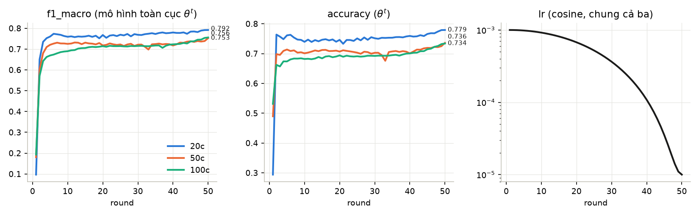
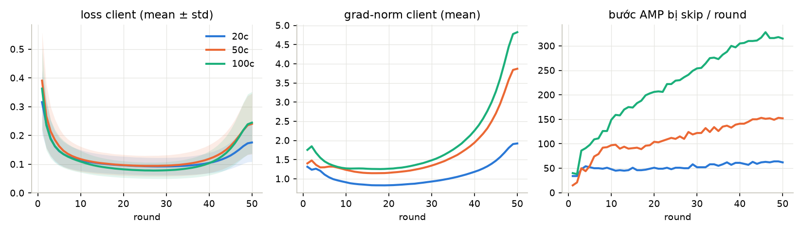
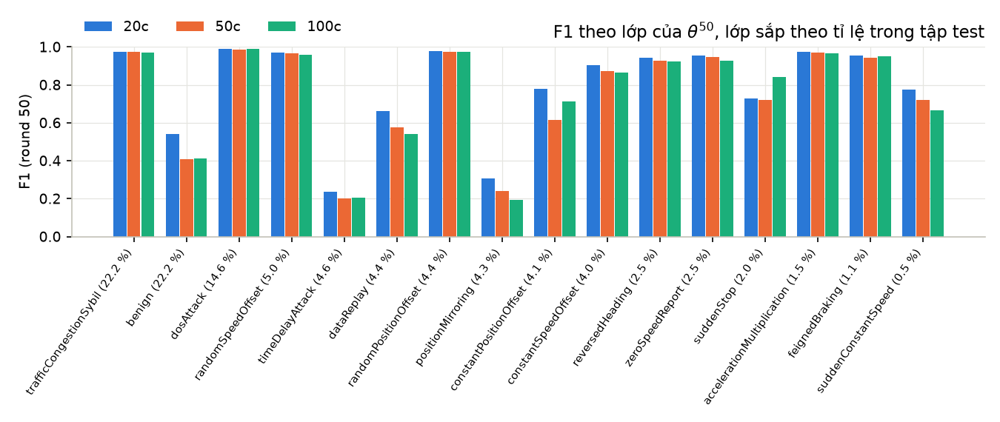
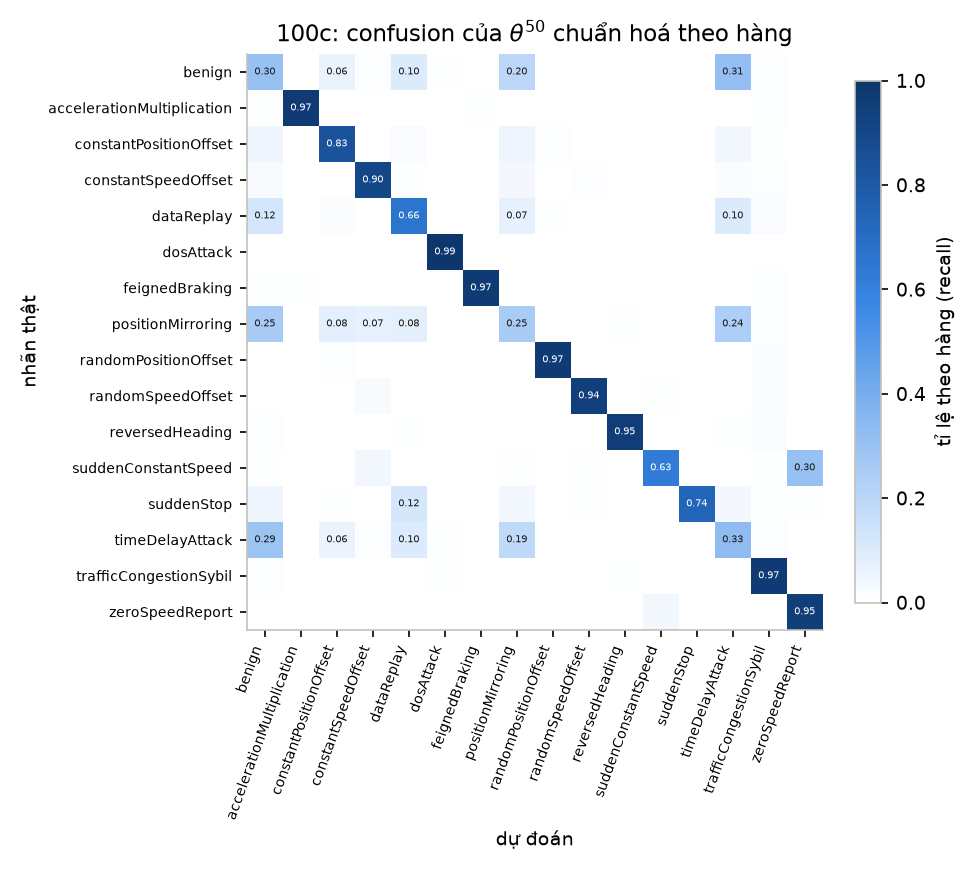
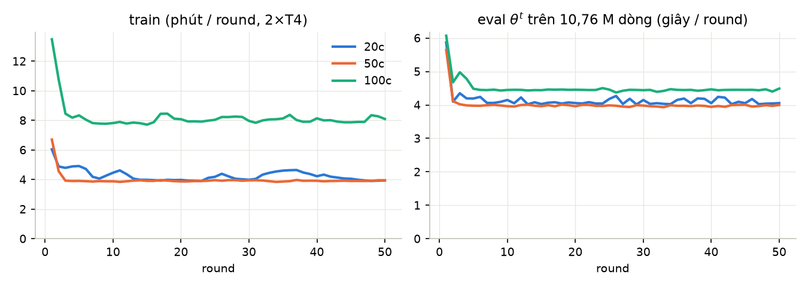

# Lightweight-Fed-NIDS trên VeReMi NextGen / DAGSNet — báo cáo kết quả

**Ngày: 2026-09-23.** Ba kịch bản 20 / 50 / 100 client, mỗi kịch bản 50 round × 1 epoch,
**hoàn tất trong một phiên Kaggle 2×T4**. Mọi con số trong báo cáo này được đọc từ artifact đã
kéo về `papers/lwfednids-bouayad-2024/runs/pulls/{20,50,100}c/runs/lwfednids_<K>c/`, sau khi
`scripts/verify_run.py --require-rounds 50` **pass** trên cả ba (§6). Không có số nào lấy từ ảnh
chụp W&B.

---

## 0. Tóm tắt

| kịch bản | round | f1_macro (round 50) | accuracy | f1_weighted | đỉnh f1_macro | Σ `seconds` 50 round |
|---|---:|---:|---:|---:|---|---:|
| 20c | 50/50 | **0,7917** | 0,7791 | 0,7853 | 0,7917 @r50 | 3,62 h |
| 50c | 50/50 | **0,7526** | 0,7360 | 0,7376 | 0,7526 @r50 | 3,38 h |
| 100c | 50/50 | **0,7557** | 0,7339 | 0,7391 | 0,7557 @r50 | 6,90 h |

Mô hình ở cả ba kịch bản là DAGSNet đã cắt 70 % kênh mỗi lớp: **35.891 tham số (9,09 % của
395.024)**, plan `524e7ab78439698c`, giống nhau trên local, probe và ba run production.

Năm điều cần mang theo:

1. **Round đỉnh là round cuối** ở cả ba kịch bản (trừ `recall_macro` của 20c, đỉnh ở r37). Không
   cần chọn checkpoint hậu nghiệm trên tập test: con số headline là round 50 và cũng là con số
   tốt nhất.
2. f1_macro **vẫn đang tăng** ở round 50. Khoảng 10 round cuối, khi lr cosine rơi từ 1e-4 xuống
   1e-5, f1_macro tăng +0,012 (20c), +0,035 (50c), +0,033 (100c) (§3.2).
3. 20c tốt nhất rõ rệt. **50c và 100c ngang nhau** (chênh 0,003 f1_macro, 100c nhỉnh hơn). Quan hệ
   ở đây không giảm đơn điệu theo số client như ở các bản dựng anh em (§4.2).
4. Bốn lớp yếu vẫn là bốn lớp quen thuộc: `timeDelayAttack`, `positionMirroring`, `benign`,
   `dataReplay`. Recall của `benign` chỉ 0,45 / 0,30 / 0,30. Nếu gộp thành hai lớp benign/attack,
   **tỉ lệ báo động giả trên lưu lượng benign là 55–70 %** (§4.4).
5. Về tốc độ, cắt tỉa cho **IA 3,70×** khi eval nhưng chỉ **TA 1,16×** khi train. Lý do: bước
   train của DAGSNet trên T4 bị giới hạn bởi số lần launch kernel (launch-bound), không phải bởi
   khối lượng tính toán (§5).

## 1. Cảnh báo phải đọc trước mọi con số

**Đây không phải bản tái lập chính xác (exact reproduction) của Bouayad et al. 2024.** Khác dữ
liệu (VeReMi 16 lớp, đặc trưng bảng), khác backbone (DAGSNet 395 k, không có feature extractor),
khác phân hoạch (Dirichlet α = 0,5 thay vì IID), khác số vòng (50 thay vì 5), và chỉ chạy một mức
sparsity. Số của bài báo chỉ dùng để **so hình dạng** của kết luận ([`paper.md` §8](paper.md)).

Mọi con số dưới đây phải được trích kèm các deviation D1–D13 ([`rebuild.md` §2](rebuild.md)).
Những điểm ảnh hưởng trực tiếp đến cách đọc:

* **D5: không có baseline chưa cắt trong cùng giao thức.** Báo cáo này **không** trả lời được
  câu "cắt 70 % có làm giảm điểm không". Các điểm tham chiếu ở §4.5 đều khác giao thức.
* **D2: "sparsity 0,7" là tỉ lệ kênh**, nghĩa là **90,9 % tham số** bị xoá, không phải 70 %.
* **D4: tổng hợp 1/N đơn** trên phân hoạch lệch. Client 98 k dòng có trọng số ngang client
  5,9 M dòng.
* **D8, D12: một seed, một mask zero-shot** chọn trên trọng số ngẫu nhiên. Không có khoảng ±
  giữa các lần chạy; `*_client_std` là độ lệch **giữa các client**, không phải giữa các lần chạy.
* Caveat của dữ liệu ([`knowledge/dataset.md` §6](../../lwfednids/knowledge/dataset.md)):
  * split theo thời gian mô phỏng, test chỉ có scenario `_7`;
  * scaler fit trên toàn bộ train (rò rỉ thống kê toàn cục vào FL);
  * rò rỉ Sybil;
  * mất cân bằng 41:1, nên **đọc f1_macro, không đọc accuracy**;
  * client là receiver unit;
  * đặc trưng lưu ở fp16 (D10).

## 2. Thiết lập

| | 20c | 50c | 100c |
|---|---:|---:|---:|
| Tài khoản / kernel | `minhtran0601/lightweight-fed-nids-veremi-20-clients` v1 | `catbaochau/lightweight-fed-nids-veremi-50-clients` v1 | `trietbackup/lightweight-fed-nids-veremi-100-clients` v1 |
| W&B run | `lwfednids_20c` | `lwfednids_50c` | `lwfednids_100c` |
| Batch mỗi client | 512 | 512 | 256 |
| Bước/round (tổng mọi client) | 84.083 | 84.098 | 168.200 |
| Dòng/client (min … max) | 870.217 … 5.890.990 | 199.063 … 2.630.929 | 98.180 … 1.333.839 |
| Phiên | 1 | 1 | 1 |
| `data_id` / `content_id` | `29f492a531052d2b` / `3aa70a5c51aacd51` | `c9b541a243f82282` / `fe175b442db619fe` | `4723f6dbf7fa5f2e` / `db2bbb68760a82ee` |
| Fingerprint | `c99b903c1ff5acd3` | `13e0284f80c36c96` | `b250bfc29a569c05` |

Chung cho cả ba kịch bản ([`rebuild.md` §1](rebuild.md)):

* **Khởi tạo và cắt tỉa:** θ₀ seed 42. Mask zero-shot tính trên server (DepGraph, L1 theo nhóm,
  70 % kênh mỗi lớp, miễn lớp Linear cuối), rồi xoá vật lý các kênh bị cắt.
* **Huấn luyện cục bộ:** mọi client train mỗi round với AdamW (wd 1e-4) tạo mới mỗi client mỗi
  round, lr cosine theo round 1e-3 → 1e-5, CE 16 lớp, clip 1,0, fp16 AMP.
* **Tổng hợp:** θ^{t+1} = (1/N) Σ θⱼ, đúng Eq. (9).
* **Eval:** mô hình tổng hợp chạy mỗi round trên đủ **10.761.343 dòng test**.
* **Môi trường:** torch 2.10.0+cu128, 2 × Tesla T4. Backend `compiled` cho train và eval ở **cả 50
  round** của cả ba run.

`data_id` của 20c production trùng với probe (`tests.md` §4.2), tức cùng dữ liệu.

## 3. Kết quả

### 3.1 Đủ 10 metric ở round 50 (mô hình toàn cục θ⁵⁰, đủ tập test)

| metric | 20c | 50c | 100c |
|---|---:|---:|---:|
| accuracy | 0,7791 | 0,7360 | 0,7339 |
| precision_macro | 0,8080 | 0,7672 | 0,7600 |
| precision_micro | 0,7791 | 0,7360 | 0,7339 |
| precision_weighted | 0,8085 | 0,7782 | 0,7804 |
| recall_macro | 0,7950 | 0,7691 | 0,7721 |
| recall_micro | 0,7791 | 0,7360 | 0,7339 |
| recall_weighted | 0,7791 | 0,7360 | 0,7339 |
| **f1_macro** | **0,7917** | **0,7526** | **0,7557** |
| f1_micro | 0,7791 | 0,7360 | 0,7339 |
| f1_weighted | 0,7853 | 0,7376 | 0,7391 |

Các metric micro bằng accuracy, như định nghĩa cho bài toán đơn nhãn. Đỉnh của cả 10 metric
đều ở r50, trừ `recall_macro` của 20c: đỉnh 0,7997 @r37, round 50 là 0,7950.

### 3.2 Quỹ đạo theo round

| round | lr | 20c f1_macro | 20c acc | 50c f1_macro | 50c acc | 100c f1_macro | 100c acc |
|---:|---:|---:|---:|---:|---:|---:|---:|
| 1 | 1,00e-3 | 0,0969 | 0,2941 | 0,1807 | 0,4897 | 0,1933 | 0,5314 |
| 2 | 9,99e-4 | 0,6502 | 0,7636 | 0,6037 | 0,6982 | 0,5714 | 0,6622 |
| 3 | 9,96e-4 | 0,7350 | 0,7568 | 0,6806 | 0,6956 | 0,6424 | 0,6569 |
| 5 | 9,84e-4 | 0,7604 | 0,7611 | 0,7207 | 0,7136 | 0,6694 | 0,6737 |
| 10 | 9,20e-4 | 0,7592 | 0,7394 | 0,7251 | 0,7010 | 0,6899 | 0,6819 |
| 15 | 8,14e-4 | 0,7608 | 0,7463 | 0,7310 | 0,7120 | 0,7051 | 0,6841 |
| 20 | 6,76e-4 | 0,7675 | 0,7460 | 0,7175 | 0,7068 | 0,7141 | 0,6938 |
| 25 | 5,21e-4 | 0,7691 | 0,7509 | 0,7223 | 0,7030 | 0,7144 | 0,6911 |
| 30 | 3,64e-4 | 0,7685 | 0,7514 | 0,7211 | 0,7026 | 0,7151 | 0,6922 |
| 35 | 2,22e-4 | 0,7726 | 0,7532 | 0,7241 | 0,7073 | 0,7172 | 0,6948 |
| 40 | 1,08e-4 | 0,7798 | 0,7592 | 0,7173 | 0,7007 | 0,7228 | 0,7006 |
| 45 | 3,52e-5 | 0,7838 | 0,7658 | 0,7375 | 0,7192 | 0,7366 | 0,7146 |
| 48 | 1,41e-5 | 0,7889 | 0,7740 | 0,7363 | 0,7216 | 0,7456 | 0,7255 |
| 49 | 1,10e-5 | 0,7914 | 0,7788 | 0,7385 | 0,7249 | 0,7537 | 0,7318 |
| 50 | 1,00e-5 | **0,7917** | 0,7791 | **0,7526** | 0,7360 | **0,7557** | 0,7339 |

Đủ 50 hàng × 34 cột ở `history.csv` của từng run; đủ 10 metric ở mọi round nằm ở
[Phụ lục](#phụ-lục-đủ-10-metric-ở-mọi-round).

## 4. Phân tích

### 4.1 Ba pha: bật nhanh, plateau, rồi tăng lại khi lr tắt dần

* **Pha 1, round 1–5: bật nhanh.** Round 1 thấp (0,10–0,19) là bình thường ([`rebuild.md` §3](rebuild.md)).
  Đến round 5, 20c và 50c đã đạt ≥ 95 % giá trị cuối.
* **Pha 2, round 5–40: plateau** ở mức 0,75–0,78 (20c), 0,715–0,73 (50c), 0,67–0,72 (100c).
  Riêng 100c vẫn nhích dần trong pha này.
* **Pha 3, round 40–50: tăng lại** khi lr rơi từ 1,1e-4 xuống 1e-5. Đây là đoạn tăng dốc nhất
  sau round 5: 20c +0,012, 50c +0,035, 100c +0,033 f1_macro. Accuracy tăng theo cùng nhịp.

Hệ quả: **50 round với lịch cosine này chưa bão hoà.** Tăng T, hoặc giữ lr thấp lâu hơn, nhiều
khả năng còn cho thêm điểm. Đây là suy luận từ độ dốc cuối, không phải điều đã đo. Khác với
AFPHA và FD-IDS, nơi đỉnh rơi ở round 3–16 rồi giảm, ở đây **checkpoint cuối cũng là checkpoint
tốt nhất**, nên con số headline không dính lựa chọn hậu nghiệm.

### 4.2 Số client: 20c > 50c ≈ 100c

20c dẫn 0,036–0,039 f1_macro so với hai kịch bản còn lại. 50c và 100c gần như trùng ở round 50
(0,7526 và 0,7557; accuracy 0,7360 và 0,7339). Quỹ đạo của hai kịch bản này khác nhau:

* **50c** plateau sớm ở ~0,72 từ round 5 và gần như không nhích đến round 40.
* **100c** xuất phát thấp hơn (0,67 ở r5) nhưng tăng chậm, đều suốt pha 2, đuổi kịp ở r40.

Với một seed (D12), chênh 0,003 **không** đủ để nói 100c tốt hơn 50c. Cách đọc an toàn là "tăng
từ 50 lên 100 client không làm giảm thêm". Hai bản dựng anh em (AFPHA, FD-IDS) thấy mức giảm đơn
điệu 50c → 100c khoảng 0,02 f1_macro. Chưa có ablation nào để biết khác biệt này đến từ mô hình
cắt nhỏ, từ tổng hợp 1/N, hay từ nhiễu seed.

### 4.3 Loss và gnorm của client tăng ở cuối trong khi điểm test tăng: không phải phân kỳ

| round | 20c loss mean ± std · gnorm mean · skipped | 50c loss mean ± std · gnorm mean · skipped | 100c loss mean ± std · gnorm mean · skipped |
|---:|---|---|---|
| 1 | 0,316 ± 0,112 · 1,31 · 34 | 0,391 ± 0,169 · 1,40 · 15 | 0,363 ± 0,142 · 1,75 · 40 |
| 5 | 0,145 ± 0,047 · 1,11 · 52 | 0,163 ± 0,062 · 1,30 · 55 | 0,146 ± 0,051 · 1,45 · 98 |
| 10 | 0,114 ± 0,036 · 0,91 · 48 | 0,118 ± 0,044 · 1,23 · 97 | 0,109 ± 0,038 · 1,27 · 149 |
| 20 | 0,096 ± 0,031 · 0,83 · 51 | 0,097 ± 0,036 · 1,16 · 104 | 0,082 ± 0,029 · 1,26 · 206 |
| 30 | 0,093 ± 0,030 · 0,93 · 52 | 0,095 ± 0,037 · 1,34 · 122 | 0,079 ± 0,029 · 1,48 · 254 |
| 40 | 0,105 ± 0,036 · 1,18 · 61 | 0,119 ± 0,048 · 1,94 · 141 | 0,104 ± 0,042 · 2,26 · 305 |
| 45 | 0,130 ± 0,046 · 1,47 · 62 | 0,164 ± 0,068 · 2,70 · 153 | 0,154 ± 0,065 · 3,28 · 317 |
| 50 | 0,176 ± 0,067 · 1,92 · 62 | 0,240 ± 0,105 · 3,87 · 152 | 0,245 ± 0,107 · 4,82 · 315 |

Loss huấn luyện trung bình của client đạt đáy khoảng r30. Sau đó loss **tăng gấp 2–3 lần** và
grad-norm tăng 2–4 lần so với đáy, **đúng lúc f1_macro trên test tăng dốc nhất**. Cách đọc sau đây là suy
luận, không phải điều đã đo trực tiếp:

* **Khi lr cao**, mỗi client đi xa khỏi θ^t trong epoch của nó và khớp phân bố lớp lệch (α = 0,5)
  của riêng mình. Loss cục bộ vì thế thấp, nhưng các mô hình client lệch nhau (client drift) nên
  trung bình 1/N kém.
* **Khi lr ≈ 1e-5**, client gần như đứng yên tại θ^t. Loss cục bộ khi đó xấp xỉ loss của **mô hình
  toàn cục** trên dữ liệu lệch của client, nên cao hơn, và gradient lớn hơn. Đổi lại, drift gần
  bằng 0 nên trung bình tốt hơn trên test.

Hai dấu hiệu khớp với cách đọc này: độ tăng loss và gnorm lớn nhất ở 50c/100c, nơi client lệch
nhất, và đó cũng là nơi f1_macro tăng nhiều nhất ở cuối.

**`skipped` tăng theo round.** Đây là mẫu hình mà [`kaggle.md` §6](../../lwfednids/docs/kaggle.md) liệt kê là dấu hiệu
dừng, nhưng ở đây không phải hỏng:

* Theo từng client, `skipped` bão hoà ở **≈ 3 bước/client/round** từ r40 (62/20, 152/50,
  315/100 ở r50). Đó là < 0,2 % trong tổng 84.083–168.200 bước/round, và thấp hơn nhiều so với
  trần `max_skips_per_client = 16`.
* Mỗi client tạo một `GradScaler` mới ở 2¹⁶ mỗi round (`driver.py:256`). Mỗi lần overflow thì scale
  giảm một nửa, nên số bước bị bỏ xấp xỉ log₂(2¹⁶ / scale chịu được). Gradient lớn hơn ở cuối cần
  scale nhỏ hơn, nên số bước bị bỏ nhiều hơn.
* `nonfinite` trên các bước **đã áp dụng** = **0** ở mọi client, mọi round của cả ba run.
* Không round nào bị `check_updates` từ chối.

### 4.4 Theo lớp ở round 50: bốn lớp yếu, `benign` bị bỏ sót 55–70 %

| lớp | support | F1 20c | F1 50c | F1 100c | P / R 20c | P / R 100c |
|---|---:|---:|---:|---:|---|---|
| `timeDelayAttack` | 490.574 | 0,2345 | 0,2005 | 0,2033 | 0,171 / 0,374 | 0,147 / 0,331 |
| `positionMirroring` | 467.049 | 0,3058 | 0,2398 | 0,1922 | 0,312 / 0,300 | 0,155 / 0,253 |
| `benign` | 2.391.136 | 0,5400 | 0,4091 | 0,4128 | 0,666 / 0,454 | 0,649 / 0,303 |
| `dataReplay` | 475.410 | 0,6603 | 0,5765 | 0,5405 | 0,579 / 0,768 | 0,459 / 0,657 |
| `suddenStop` | 211.445 | 0,7286 | 0,7194 | 0,8430 | 0,995 / 0,575 | 0,978 / 0,741 |
| `suddenConstantSpeed` | 57.757 | 0,7737 | 0,7220 | 0,6645 | 0,905 / 0,676 | 0,708 / 0,626 |
| `constantPositionOffset` | 442.475 | 0,7793 | 0,6155 | 0,7119 | 0,697 / 0,883 | 0,623 / 0,830 |
| `constantSpeedOffset` | 433.177 | 0,9026 | 0,8711 | 0,8640 | 0,894 / 0,911 | 0,832 / 0,898 |
| `reversedHeading` | 269.999 | 0,9447 | 0,9281 | 0,9233 | 0,930 / 0,960 | 0,894 / 0,954 |
| `feignedBraking` | 118.605 | 0,9546 | 0,9434 | 0,9522 | 0,941 / 0,968 | 0,937 / 0,968 |
| `zeroSpeedReport` | 266.359 | 0,9562 | 0,9481 | 0,9284 | 0,929 / 0,985 | 0,910 / 0,947 |
| `randomSpeedOffset` | 542.163 | 0,9713 | 0,9645 | 0,9591 | 0,982 / 0,961 | 0,976 / 0,943 |
| `accelerationMultiplication` | 157.490 | 0,9733 | 0,9690 | 0,9663 | 0,978 / 0,969 | 0,963 / 0,970 |
| `trafficCongestionSybil` | 2.393.335 | 0,9743 | 0,9730 | 0,9696 | 0,973 / 0,976 | 0,968 / 0,971 |
| `randomPositionOffset` | 470.279 | 0,9776 | 0,9742 | 0,9729 | 0,985 / 0,970 | 0,979 / 0,967 |
| `dosAttack` | 1.574.090 | 0,9907 | 0,9873 | 0,9878 | 0,988 / 0,994 | 0,982 / 0,994 |

**Nhóm lớp gần hoàn hảo.** 8/16 lớp có F1 ≥ 0,92 ở cả ba kịch bản. Đó là các lớp có chữ ký rõ
**trên từng message**, như `dosAttack`, `randomPositionOffset`, `trafficCongestionSybil` và nhóm
offset/multiplication. Cả 16 lớp đều được dự đoán ít nhất một lần và có F1 > 0.

**Bốn lớp yếu nhất trùng với các bản dựng anh em.** Đó là `timeDelayAttack`, `positionMirroring`,
`benign`, `dataReplay`. Ba lớp tấn công trong số này đều phát đi **nội dung message hợp lệ**:
message thật bị trễ, vị trí thật bị phản chiếu, hoặc message thật phát lại. Chúng chỉ khác
`benign` ở ngữ cảnh thời gian giữa các message, thứ mà 66 đặc trưng của một message nhìn thấy rất
hạn chế. Trong ma trận nhầm lẫn round 50, `benign` bị dự đoán thành:

| | → `timeDelayAttack` | → `positionMirroring` | → `dataReplay` | → `constantPositionOffset` | recall `benign` |
|---|---:|---:|---:|---:|---:|
| 20c | 32,2 % | 9,8 % | 5,9 % | 4,8 % | 0,454 |
| 50c | 26,0 % | 20,7 % | 8,1 % | 12,4 % | 0,301 |
| 100c | 31,2 % | 19,6 % | 10,1 % | 6,0 % | 0,303 |

Chiều ngược lại: 43 % / 29 % / 29 % dòng `timeDelayAttack` bị dự đoán thành `benign`.

**Nhìn như IDS hai lớp** (gộp 15 lớp tấn công thành "attack"; tính từ `confusion/round_050.npy`):

| | tỉ lệ phát hiện tấn công | báo động giả trên `benign` | accuracy nhị phân |
|---|---:|---:|---:|
| 20c | 93,5 % | **54,6 %** | 82,8 % |
| 50c | 95,1 % | **69,9 %** | 80,7 % |
| 100c | 95,3 % | **69,7 %** | 80,9 % |

> **Kết luận vận hành:** f1_macro 0,75–0,79 **không** có nghĩa là một IDS dùng được. Hơn một
> nửa lưu lượng benign bị gắn cờ tấn công. Muốn cải thiện thì phải thêm đặc trưng theo chuỗi hoặc
> ngữ cảnh; chỉnh siêu tham số FL hay mức cắt tỉa sẽ không giải quyết được.

### 4.5 Điểm tham chiếu: cùng dữ liệu nhưng khác giao thức, không phải ablation

| cấu hình | tham số | 20c | 50c | 100c | nguồn |
|---|---:|---:|---:|---:|---|
| **Lightweight-Fed-NIDS (bản này)**: cắt 70 % kênh, FedAvg 1/N, AdamW wd 1e-4 | **35.891** | **0,7917** | **0,7526** | **0,7557** | §3.1 |
| AFPHA: DAGSNet đầy đủ, FedAvg + prox thích nghi, Adam wd 0, trọng số n_i/N | 395.024 | 0,7752 | 0,7162 | 0,6949 | [`afpha/docs/report.md` §3](https://github.com/odixe06/fl_dagsnet_veremi/blob/master/afpha/docs/report.md#3-kết-quả-tổng-hợp) |
| FD-IDS: DAGSNet đầy đủ, FedProx + KD theo round | 395.024 | 0,7655 | 0,6815 | 0,6606 | [`fd_ids/docs/report.md` §0](https://github.com/odixe06/fl_dagsnet_veremi/blob/master/fd_ids/docs/report.md#0-tóm-tắt) |
| DAGSNet **centralized**: không FL, round cuối (r49) / round đỉnh chọn hậu nghiệm (r5) | 395.024 | 0,8365 / 0,8532 | | | [`knowledge/architecture.md`](../../lwfednids/knowledge/architecture.md) |

Tất cả các số trên là f1_macro ở round cuối (round 50 với FL).

Những gì được phép kết luận từ bảng này:

* Mô hình đã cắt, với **9 % tham số**, **không kém** hai bản dựng FL của DAGSNet đầy đủ trên cùng
  phân hoạch và cùng tập test. Ở 20c nó cao hơn 0,02–0,03; ở 50c/100c cao hơn 0,04–0,10.
* Khoảng cách tới DAGSNet centralized (round cuối) là 0,045 ở 20c.

Những gì **không** được kết luận: "cắt tỉa làm tăng điểm". Ba dòng FL khác nhau ở optimizer, luật
tổng hợp, loss và mô hình cùng lúc. Câu hỏi "cắt tỉa có giữ hiệu năng không" chỉ trả lời được bằng
một run DAGSNet đầy đủ theo **đúng** giao thức này (D5; xem §8).

## 5. Hiệu năng và chi phí

### 5.1 TA / IA: cell calibration của probe

Nguồn là `runs/pulls/20c_probe/runs/lwfednids_20c_probe/reports/calibration.json`, đo trên GPU 0
với batch 512, client nhỏ nhất, 400 bước; eval chạy trên đủ tập test.

| | mô hình cắt (35.891) | chưa cắt (395.024) | tỉ lệ |
|---|---:|---:|---:|
| train **compiled**, ms/bước | 5,854 | 6,783 | **TA 1,16×** |
| train eager, ms/bước | 59,29 | 30,94 | 0,52× |
| eval compiled-folded @16384, rows/s | 1.468.885 | 397.276 | **IA 3,70×** |
| eval compiled-folded @32768, rows/s | 1.519.366 | 384.660 | 3,95× |

* **Train:** bước train launch-bound, tức thời gian bị chi phối bởi chi phí gọi kernel chứ không
  bởi phép tính. Vì vậy cắt 91 % tham số chỉ nhanh hơn 16 %.
* **Eval:** ở batch lớn, eval compute-bound nên cắt tỉa cho gần 4×.
* **Eager:** ở chế độ eager, mô hình cắt còn chậm hơn mô hình đầy đủ, do số kênh lẻ không phải bội
  8 (D13). Production luôn chạy compiled nên không bị ảnh hưởng.

So hình dạng với bài báo (TA ×2,03 ở sparsity 70 % với ResNet-101): bản dựng này có hướng tăng
tốc giống bài báo nhưng TA nhỏ hơn nhiều khi train. Nguyên nhân là mô hình gốc đã nhỏ và
launch-bound (D1).

### 5.2 Thời gian round, VRAM, truyền tin: số đo production

| | 20c | 50c | 100c |
|---|---:|---:|---:|
| round 1 (s): warm-up CUDA graph | 368,6 | 408,0 | 815,3 |
| round trung vị (s) | 253,8 | 238,9 | 485,1 |
| train / eval trung vị (s) | 249,8 / 4,07 | 234,9 / 3,98 | 480,6 / 4,45 |
| Σ 50 round (h), chưa tính startup ~5 phút | **3,62** | **3,38** | **6,90** |
| VRAM đỉnh train / eval (GiB/GPU) | 6,95 / 6,97 | 6,80 / 6,97 | 6,74 / 6,97 |
| kích thước mô hình `model_mib` | 0,1406 | 0,1406 | 0,1406 |
| truyền tin/round `comm_mib` = 2·N·model_mib (D11) | 5,63 | 14,06 | 28,13 |

Dự báo từ probe cho 20c (≈ 3,5 h) sát với thực tế. 100c chạy nhanh hơn dự báo (7–8,5 h) nên
**không** cần phiên 2: ngân sách phiên là 11,75 h, dùng hết 6,9 h. Tính theo tham số, truyền tin giảm 91 % so với
DAGSNet đầy đủ. Đây là con số **tính** từ giao thức, không phải đo trên mạng.

## 6. Tính toàn vẹn của artifact

| kiểm | 20c | 50c | 100c |
|---|---|---|---|
| `verify_run.py --require-rounds 50` | **pass** | **pass** | **pass** |
| round hoàn tất (marker `complete/`) | 1..50 | 1..50 | 1..50 |
| backend train / eval, cả 50 round | compiled / compiled | compiled / compiled | compiled / compiled |
| `nonfinite` (tổng mọi client, mọi round) | 0 | 0 | 0 |
| plan id / n_params dựng lại từ `weights/round_NNN.pt` | `524e7ab78439698c` / 35.891 | ↑ | ↑ |
| phiên (`manifest.sessions`) | 1 | 1 | 1 |

`verify_run.py` kiểm các điểm sau:

* metric trong json, ma trận nhầm lẫn, `history.csv` và `clients.csv` khớp nhau;
* `preds/round_050.u8.npy` dựng lại đúng ma trận nhầm lẫn round 50;
* log per-client khớp;
* **mọi** file trọng số dựng lại được mô hình cắt từ `cfg` của chính nó (`strict=True`, không cần
  torch-pruning), và fingerprint khớp manifest.

## 7. So với kết luận của bài báo (chỉ so hình dạng)

| bài báo nói | bản dựng này thấy |
|---|---|
| Sparsity 70 % giữ hiệu năng gần mô hình gốc | **Không kiểm được trực tiếp** (D5). Gián tiếp: mô hình cắt 9 % tham số không kém các bản FL của DAGSNet đầy đủ trên cùng dữ liệu (§4.5) |
| Cắt tỉa tăng tốc train (TA ×2–3,6) | TA **1,16×**: mô hình gốc đã nhỏ và launch-bound trên T4 (D1) |
| Cắt tỉa tăng tốc suy luận | IA **3,70×** (3,95× ở batch 32768) |
| Mô hình nhỏ hơn ~90 % | Đúng: 90,9 % tham số bị xoá. Truyền tin mỗi round giảm tương ứng |
| Nhiều client hơn thì khó hơn | 20c > 50c ≈ 100c (§4.2) |

## 8. Việc còn mở

1. **Baseline chưa cắt theo đúng giao thức này.** Đây là run duy nhất trả lời được câu hỏi trung
   tâm của bài báo trên VeReMi. Chi phí ước tính ≈ 3 phiên 2×T4: train compiled 6,78 so với 5,85
   ms/bước ⇒ ~4,2 / 3,9 / 8 h. Cần chủ dự án quyết định có chạy không.
2. Nếu muốn biết đường cong còn lên được bao xa: tăng T, hoặc giữ lr 1e-5 thêm vài round (§4.1).
   Việc này đổi cấu hình đã chốt, nên cần hỏi trước.
3. Dọn probe kernel `minhtran0601/lightweight-fed-nids-veremi-20-clients-probe` trên Kaggle
   ([`CONTEXT.md` §5](../../lwfednids/CONTEXT.md)). Đây là thao tác xoá ngoài repo; **chủ dự án quyết định**.

## 9. Artifact

| đường dẫn | nội dung |
|---|---|
| `papers/lwfednids-bouayad-2024/runs/pulls/<K>c/runs/lwfednids_<K>c/history.csv` | 50 hàng × 34 cột: 10 metric, thống kê client, thời gian |
| `…/clients.csv` | một hàng mỗi client mỗi round |
| `…/metrics/round_NNN.json` | hàng history + `per_class` + `clients` |
| `…/confusion/round_NNN.npy` | 16×16 int64 trên đủ tập test |
| `…/preds/round_050.u8.npy` | dự đoán round 50 (10.761.343,) |
| `…/weights/round_NNN.pt` | θ^t + cfg có plan, nạp bằng `weights_only=True` → `build_model(cfg)` |
| `…/reports/{manifest.json, prune_plan.json, y_true.u8.npy}` | cfg, fingerprint, data_id, bảng cắt tỉa, nhãn test |
| `runs/pulls/20c_probe/…/reports/calibration.json` | TA / IA |
| `papers/lwfednids-bouayad-2024/report_data/*.png` | hình của báo cáo, sinh bởi `scripts/report_figures.py` từ các cây ở trên |

---

## Phụ lục: đủ 10 metric ở mọi round

Ba run chính thức, đọc nguyên văn từ `papers/lwfednids-bouayad-2024/runs/pulls/<K>c/runs/lwfednids_<K>c/history.csv`
(mô hình toàn cục θ^t trên đủ tập test). Loss và gnorm là trung bình trên các client của round đó;
`skipped` là tổng số bước mà `GradScaler` bỏ do overflow, cộng trên mọi client (xem §4.3); `giây` là
thời gian cả round. Hàng round 50 khớp §3.1.

### A. 20 client — 50/50 round (chính thức)

| round | lr | accuracy | precision_macro | precision_micro | precision_weighted | recall_macro | recall_micro | recall_weighted | f1_macro | f1_micro | f1_weighted | loss client mean ± std | gnorm mean | skipped | giây |
|---:|---:|---:|---:|---:|---:|---:|---:|---:|---:|---:|---:|---:|---:|---:|---:|
| 1 | 1,00e-3 | 0,2941 | 0,3582 | 0,2941 | 0,5014 | 0,1266 | 0,2941 | 0,2941 | 0,0969 | 0,2941 | 0,2658 | 0,316 ± 0,112 | 1,31 | 34 | 369 |
| 2 | 9,99e-4 | 0,7636 | 0,7341 | 0,7636 | 0,7674 | 0,6424 | 0,7636 | 0,7636 | 0,6502 | 0,7636 | 0,7419 | 0,240 ± 0,082 | 1,24 | 34 | 297 |
| 3 | 9,96e-4 | 0,7568 | 0,7644 | 0,7568 | 0,7854 | 0,7344 | 0,7568 | 0,7568 | 0,7350 | 0,7568 | 0,7614 | 0,191 ± 0,062 | 1,26 | 48 | 292 |
| 4 | 9,91e-4 | 0,7483 | 0,7633 | 0,7483 | 0,7852 | 0,7677 | 0,7483 | 0,7483 | 0,7524 | 0,7483 | 0,7503 | 0,162 ± 0,053 | 1,21 | 54 | 298 |
| 5 | 9,84e-4 | 0,7611 | 0,7749 | 0,7611 | 0,7895 | 0,7722 | 0,7611 | 0,7611 | 0,7604 | 0,7611 | 0,7625 | 0,145 ± 0,047 | 1,11 | 52 | 299 |
| 6 | 9,75e-4 | 0,7629 | 0,7933 | 0,7629 | 0,8015 | 0,7814 | 0,7629 | 0,7629 | 0,7735 | 0,7629 | 0,7679 | 0,135 ± 0,044 | 1,04 | 50 | 288 |
| 7 | 9,64e-4 | 0,7537 | 0,7881 | 0,7537 | 0,7968 | 0,7829 | 0,7537 | 0,7537 | 0,7711 | 0,7537 | 0,7576 | 0,128 ± 0,041 | 0,99 | 50 | 255 |
| 8 | 9,51e-4 | 0,7470 | 0,7855 | 0,7470 | 0,7935 | 0,7843 | 0,7470 | 0,7470 | 0,7684 | 0,7470 | 0,7486 | 0,122 ± 0,039 | 0,96 | 49 | 248 |
| 9 | 9,36e-4 | 0,7460 | 0,7752 | 0,7460 | 0,7864 | 0,7829 | 0,7460 | 0,7460 | 0,7627 | 0,7460 | 0,7449 | 0,117 ± 0,038 | 0,93 | 51 | 260 |
| 10 | 9,20e-4 | 0,7394 | 0,7763 | 0,7394 | 0,7857 | 0,7799 | 0,7394 | 0,7394 | 0,7592 | 0,7394 | 0,7378 | 0,114 ± 0,036 | 0,91 | 48 | 272 |
| 11 | 9,02e-4 | 0,7468 | 0,7795 | 0,7468 | 0,7875 | 0,7791 | 0,7468 | 0,7468 | 0,7612 | 0,7468 | 0,7463 | 0,110 ± 0,035 | 0,88 | 45 | 281 |
| 12 | 8,82e-4 | 0,7391 | 0,7758 | 0,7391 | 0,7857 | 0,7791 | 0,7391 | 0,7391 | 0,7575 | 0,7391 | 0,7372 | 0,108 ± 0,034 | 0,87 | 46 | 266 |
| 13 | 8,61e-4 | 0,7452 | 0,7785 | 0,7452 | 0,7865 | 0,7792 | 0,7452 | 0,7452 | 0,7606 | 0,7452 | 0,7449 | 0,106 ± 0,033 | 0,86 | 45 | 248 |
| 14 | 8,38e-4 | 0,7412 | 0,7793 | 0,7412 | 0,7861 | 0,7782 | 0,7412 | 0,7412 | 0,7595 | 0,7412 | 0,7407 | 0,104 ± 0,033 | 0,85 | 46 | 243 |
| 15 | 8,14e-4 | 0,7463 | 0,7793 | 0,7463 | 0,7875 | 0,7790 | 0,7463 | 0,7463 | 0,7608 | 0,7463 | 0,7460 | 0,102 ± 0,032 | 0,84 | 51 | 243 |
| 16 | 7,88e-4 | 0,7482 | 0,7790 | 0,7482 | 0,7863 | 0,7828 | 0,7482 | 0,7482 | 0,7642 | 0,7482 | 0,7483 | 0,100 ± 0,032 | 0,83 | 46 | 242 |
| 17 | 7,62e-4 | 0,7442 | 0,7785 | 0,7442 | 0,7864 | 0,7780 | 0,7442 | 0,7442 | 0,7589 | 0,7442 | 0,7434 | 0,099 ± 0,031 | 0,83 | 46 | 240 |
| 18 | 7,34e-4 | 0,7474 | 0,7789 | 0,7474 | 0,7864 | 0,7841 | 0,7474 | 0,7474 | 0,7641 | 0,7474 | 0,7463 | 0,098 ± 0,031 | 0,83 | 47 | 243 |
| 19 | 7,05e-4 | 0,7398 | 0,7679 | 0,7398 | 0,7816 | 0,7737 | 0,7398 | 0,7398 | 0,7518 | 0,7398 | 0,7398 | 0,097 ± 0,031 | 0,83 | 49 | 242 |
| 20 | 6,76e-4 | 0,7460 | 0,7817 | 0,7460 | 0,7893 | 0,7868 | 0,7460 | 0,7460 | 0,7675 | 0,7460 | 0,7457 | 0,096 ± 0,031 | 0,83 | 51 | 243 |
| 21 | 6,46e-4 | 0,7328 | 0,7743 | 0,7328 | 0,7831 | 0,7753 | 0,7328 | 0,7328 | 0,7542 | 0,7328 | 0,7345 | 0,096 ± 0,031 | 0,83 | 49 | 240 |
| 22 | 6,15e-4 | 0,7457 | 0,7813 | 0,7457 | 0,7891 | 0,7840 | 0,7457 | 0,7457 | 0,7648 | 0,7457 | 0,7458 | 0,095 ± 0,031 | 0,84 | 49 | 240 |
| 23 | 5,84e-4 | 0,7455 | 0,7834 | 0,7455 | 0,7899 | 0,7858 | 0,7455 | 0,7455 | 0,7672 | 0,7455 | 0,7456 | 0,094 ± 0,030 | 0,85 | 51 | 238 |
| 24 | 5,53e-4 | 0,7425 | 0,7812 | 0,7425 | 0,7888 | 0,7805 | 0,7425 | 0,7425 | 0,7625 | 0,7425 | 0,7445 | 0,094 ± 0,030 | 0,86 | 48 | 251 |
| 25 | 5,21e-4 | 0,7509 | 0,7836 | 0,7509 | 0,7904 | 0,7866 | 0,7509 | 0,7509 | 0,7691 | 0,7509 | 0,7515 | 0,093 ± 0,030 | 0,87 | 51 | 256 |
| 26 | 4,89e-4 | 0,7444 | 0,7816 | 0,7444 | 0,7895 | 0,7857 | 0,7444 | 0,7444 | 0,7657 | 0,7444 | 0,7445 | 0,093 ± 0,030 | 0,87 | 51 | 268 |
| 27 | 4,57e-4 | 0,7541 | 0,7863 | 0,7541 | 0,7932 | 0,7888 | 0,7541 | 0,7541 | 0,7725 | 0,7541 | 0,7558 | 0,093 ± 0,030 | 0,89 | 50 | 257 |
| 28 | 4,26e-4 | 0,7462 | 0,7777 | 0,7462 | 0,7884 | 0,7801 | 0,7462 | 0,7462 | 0,7614 | 0,7462 | 0,7490 | 0,092 ± 0,030 | 0,90 | 50 | 248 |
| 29 | 3,95e-4 | 0,7549 | 0,7848 | 0,7549 | 0,7921 | 0,7892 | 0,7549 | 0,7549 | 0,7718 | 0,7549 | 0,7559 | 0,092 ± 0,030 | 0,91 | 58 | 245 |
| 30 | 3,64e-4 | 0,7514 | 0,7835 | 0,7514 | 0,7922 | 0,7870 | 0,7514 | 0,7514 | 0,7685 | 0,7514 | 0,7520 | 0,093 ± 0,030 | 0,93 | 52 | 244 |
| 31 | 3,34e-4 | 0,7496 | 0,7836 | 0,7496 | 0,7920 | 0,7858 | 0,7496 | 0,7496 | 0,7676 | 0,7496 | 0,7510 | 0,093 ± 0,030 | 0,94 | 52 | 247 |
| 32 | 3,05e-4 | 0,7529 | 0,7854 | 0,7529 | 0,7933 | 0,7894 | 0,7529 | 0,7529 | 0,7717 | 0,7529 | 0,7543 | 0,093 ± 0,031 | 0,96 | 52 | 264 |
| 33 | 2,76e-4 | 0,7525 | 0,7874 | 0,7525 | 0,7945 | 0,7918 | 0,7525 | 0,7525 | 0,7737 | 0,7525 | 0,7536 | 0,094 ± 0,031 | 0,98 | 58 | 272 |
| 34 | 2,48e-4 | 0,7531 | 0,7874 | 0,7531 | 0,7953 | 0,7960 | 0,7531 | 0,7531 | 0,7763 | 0,7531 | 0,7538 | 0,094 ± 0,031 | 1,00 | 58 | 277 |
| 35 | 2,22e-4 | 0,7532 | 0,7863 | 0,7532 | 0,7940 | 0,7906 | 0,7532 | 0,7532 | 0,7726 | 0,7532 | 0,7548 | 0,095 ± 0,032 | 1,03 | 55 | 281 |
| 36 | 1,96e-4 | 0,7552 | 0,7887 | 0,7552 | 0,7958 | 0,7955 | 0,7552 | 0,7552 | 0,7773 | 0,7552 | 0,7566 | 0,096 ± 0,032 | 1,05 | 58 | 282 |
| 37 | 1,72e-4 | 0,7555 | 0,7882 | 0,7555 | 0,7958 | 0,7997 | 0,7555 | 0,7555 | 0,7799 | 0,7555 | 0,7564 | 0,098 ± 0,033 | 1,08 | 62 | 283 |
| 38 | 1,49e-4 | 0,7544 | 0,7892 | 0,7544 | 0,7966 | 0,7943 | 0,7544 | 0,7544 | 0,7762 | 0,7544 | 0,7561 | 0,100 ± 0,034 | 1,11 | 57 | 273 |
| 39 | 1,28e-4 | 0,7575 | 0,7884 | 0,7575 | 0,7962 | 0,7953 | 0,7575 | 0,7575 | 0,7775 | 0,7575 | 0,7592 | 0,102 ± 0,034 | 1,15 | 61 | 267 |
| 40 | 1,08e-4 | 0,7592 | 0,7890 | 0,7592 | 0,7975 | 0,7975 | 0,7592 | 0,7592 | 0,7798 | 0,7592 | 0,7614 | 0,105 ± 0,036 | 1,18 | 61 | 258 |
| 41 | 9,01e-5 | 0,7570 | 0,7906 | 0,7570 | 0,7981 | 0,7948 | 0,7570 | 0,7570 | 0,7777 | 0,7570 | 0,7592 | 0,108 ± 0,037 | 1,22 | 59 | 264 |
| 42 | 7,37e-5 | 0,7578 | 0,7914 | 0,7578 | 0,7983 | 0,7933 | 0,7578 | 0,7578 | 0,7776 | 0,7578 | 0,7610 | 0,112 ± 0,038 | 1,27 | 57 | 256 |
| 43 | 5,90e-5 | 0,7617 | 0,7930 | 0,7617 | 0,7997 | 0,7948 | 0,7617 | 0,7617 | 0,7801 | 0,7617 | 0,7648 | 0,117 ± 0,041 | 1,32 | 63 | 252 |
| 44 | 4,62e-5 | 0,7589 | 0,7860 | 0,7589 | 0,7968 | 0,7907 | 0,7589 | 0,7589 | 0,7736 | 0,7589 | 0,7612 | 0,123 ± 0,043 | 1,39 | 59 | 249 |
| 45 | 3,52e-5 | 0,7658 | 0,7965 | 0,7658 | 0,8018 | 0,7961 | 0,7658 | 0,7658 | 0,7838 | 0,7658 | 0,7701 | 0,130 ± 0,046 | 1,47 | 62 | 248 |
| 46 | 2,62e-5 | 0,7683 | 0,7995 | 0,7683 | 0,8036 | 0,7946 | 0,7683 | 0,7683 | 0,7846 | 0,7683 | 0,7732 | 0,140 ± 0,050 | 1,57 | 63 | 244 |
| 47 | 1,91e-5 | 0,7681 | 0,7984 | 0,7681 | 0,8028 | 0,7908 | 0,7681 | 0,7681 | 0,7818 | 0,7681 | 0,7734 | 0,151 ± 0,055 | 1,68 | 62 | 241 |
| 48 | 1,41e-5 | 0,7740 | 0,8048 | 0,7740 | 0,8067 | 0,7950 | 0,7740 | 0,7740 | 0,7889 | 0,7740 | 0,7799 | 0,163 ± 0,061 | 1,81 | 64 | 239 |
| 49 | 1,10e-5 | 0,7788 | 0,8074 | 0,7788 | 0,8082 | 0,7951 | 0,7788 | 0,7788 | 0,7914 | 0,7788 | 0,7849 | 0,173 ± 0,065 | 1,91 | 64 | 240 |
| 50 | 1,00e-5 | 0,7791 | 0,8080 | 0,7791 | 0,8085 | 0,7950 | 0,7791 | 0,7791 | 0,7917 | 0,7791 | 0,7853 | 0,176 ± 0,067 | 1,92 | 62 | 241 |

### B. 50 client — 50/50 round (chính thức)

| round | lr | accuracy | precision_macro | precision_micro | precision_weighted | recall_macro | recall_micro | recall_weighted | f1_macro | f1_micro | f1_weighted | loss client mean ± std | gnorm mean | skipped | giây |
|---:|---:|---:|---:|---:|---:|---:|---:|---:|---:|---:|---:|---:|---:|---:|---:|
| 1 | 1,00e-3 | 0,4897 | 0,4528 | 0,4897 | 0,5680 | 0,2114 | 0,4897 | 0,4897 | 0,1807 | 0,4897 | 0,4420 | 0,391 ± 0,169 | 1,40 | 15 | 408 |
| 2 | 9,99e-4 | 0,6982 | 0,7283 | 0,6982 | 0,7570 | 0,5845 | 0,6982 | 0,6982 | 0,6037 | 0,6982 | 0,6994 | 0,267 ± 0,111 | 1,48 | 21 | 278 |
| 3 | 9,96e-4 | 0,6956 | 0,7171 | 0,6956 | 0,7577 | 0,6848 | 0,6956 | 0,6956 | 0,6806 | 0,6956 | 0,7064 | 0,215 ± 0,085 | 1,36 | 50 | 240 |
| 4 | 9,91e-4 | 0,7091 | 0,7177 | 0,7091 | 0,7588 | 0,7194 | 0,7091 | 0,7091 | 0,7098 | 0,7091 | 0,7205 | 0,185 ± 0,072 | 1,30 | 44 | 238 |
| 5 | 9,84e-4 | 0,7136 | 0,7255 | 0,7136 | 0,7621 | 0,7364 | 0,7136 | 0,7136 | 0,7207 | 0,7136 | 0,7206 | 0,163 ± 0,062 | 1,30 | 55 | 239 |
| 6 | 9,75e-4 | 0,7087 | 0,7317 | 0,7087 | 0,7651 | 0,7508 | 0,7087 | 0,7087 | 0,7264 | 0,7087 | 0,7104 | 0,147 ± 0,056 | 1,32 | 74 | 237 |
| 7 | 9,64e-4 | 0,7107 | 0,7374 | 0,7107 | 0,7680 | 0,7570 | 0,7107 | 0,7107 | 0,7308 | 0,7107 | 0,7093 | 0,136 ± 0,051 | 1,32 | 79 | 236 |
| 8 | 9,51e-4 | 0,7032 | 0,7392 | 0,7032 | 0,7673 | 0,7582 | 0,7032 | 0,7032 | 0,7272 | 0,7032 | 0,6961 | 0,129 ± 0,048 | 1,29 | 92 | 238 |
| 9 | 9,36e-4 | 0,7044 | 0,7376 | 0,7044 | 0,7681 | 0,7619 | 0,7044 | 0,7044 | 0,7269 | 0,7044 | 0,6962 | 0,123 ± 0,046 | 1,26 | 93 | 237 |
| 10 | 9,20e-4 | 0,7010 | 0,7388 | 0,7010 | 0,7677 | 0,7601 | 0,7010 | 0,7010 | 0,7251 | 0,7010 | 0,6907 | 0,118 ± 0,044 | 1,23 | 97 | 237 |
| 11 | 9,02e-4 | 0,7033 | 0,7399 | 0,7033 | 0,7682 | 0,7608 | 0,7033 | 0,7033 | 0,7267 | 0,7033 | 0,6939 | 0,114 ± 0,042 | 1,21 | 98 | 235 |
| 12 | 8,82e-4 | 0,7066 | 0,7423 | 0,7066 | 0,7689 | 0,7650 | 0,7066 | 0,7066 | 0,7316 | 0,7066 | 0,6982 | 0,111 ± 0,041 | 1,19 | 90 | 237 |
| 13 | 8,61e-4 | 0,7105 | 0,7399 | 0,7105 | 0,7669 | 0,7639 | 0,7105 | 0,7105 | 0,7306 | 0,7105 | 0,7033 | 0,108 ± 0,040 | 1,17 | 94 | 240 |
| 14 | 8,38e-4 | 0,7081 | 0,7367 | 0,7081 | 0,7636 | 0,7585 | 0,7081 | 0,7081 | 0,7237 | 0,7081 | 0,6995 | 0,105 ± 0,039 | 1,16 | 90 | 241 |
| 15 | 8,14e-4 | 0,7120 | 0,7391 | 0,7120 | 0,7634 | 0,7649 | 0,7120 | 0,7120 | 0,7310 | 0,7120 | 0,7038 | 0,104 ± 0,038 | 1,15 | 91 | 239 |
| 16 | 7,88e-4 | 0,7124 | 0,7361 | 0,7124 | 0,7621 | 0,7616 | 0,7124 | 0,7124 | 0,7274 | 0,7124 | 0,7050 | 0,102 ± 0,038 | 1,15 | 92 | 239 |
| 17 | 7,62e-4 | 0,7084 | 0,7374 | 0,7084 | 0,7633 | 0,7613 | 0,7084 | 0,7084 | 0,7261 | 0,7084 | 0,6994 | 0,101 ± 0,037 | 1,15 | 89 | 242 |
| 18 | 7,34e-4 | 0,7088 | 0,7366 | 0,7088 | 0,7634 | 0,7580 | 0,7088 | 0,7088 | 0,7226 | 0,7088 | 0,7000 | 0,099 ± 0,037 | 1,15 | 96 | 240 |
| 19 | 7,05e-4 | 0,7098 | 0,7390 | 0,7098 | 0,7645 | 0,7643 | 0,7098 | 0,7098 | 0,7290 | 0,7098 | 0,7014 | 0,098 ± 0,037 | 1,15 | 97 | 238 |
| 20 | 6,76e-4 | 0,7068 | 0,7318 | 0,7068 | 0,7614 | 0,7543 | 0,7068 | 0,7068 | 0,7175 | 0,7068 | 0,6988 | 0,097 ± 0,036 | 1,16 | 104 | 236 |
| 21 | 6,46e-4 | 0,7110 | 0,7338 | 0,7110 | 0,7617 | 0,7559 | 0,7110 | 0,7110 | 0,7204 | 0,7110 | 0,7031 | 0,096 ± 0,036 | 1,17 | 103 | 237 |
| 22 | 6,15e-4 | 0,7091 | 0,7385 | 0,7091 | 0,7624 | 0,7628 | 0,7091 | 0,7091 | 0,7272 | 0,7091 | 0,6997 | 0,095 ± 0,036 | 1,17 | 106 | 238 |
| 23 | 5,84e-4 | 0,7073 | 0,7359 | 0,7073 | 0,7628 | 0,7594 | 0,7073 | 0,7073 | 0,7228 | 0,7073 | 0,6983 | 0,095 ± 0,036 | 1,19 | 109 | 238 |
| 24 | 5,53e-4 | 0,7053 | 0,7348 | 0,7053 | 0,7620 | 0,7570 | 0,7053 | 0,7053 | 0,7200 | 0,7053 | 0,6960 | 0,094 ± 0,036 | 1,20 | 112 | 239 |
| 25 | 5,21e-4 | 0,7030 | 0,7362 | 0,7030 | 0,7636 | 0,7609 | 0,7030 | 0,7030 | 0,7223 | 0,7030 | 0,6913 | 0,094 ± 0,036 | 1,22 | 110 | 242 |
| 26 | 4,89e-4 | 0,6994 | 0,7309 | 0,6994 | 0,7619 | 0,7554 | 0,6994 | 0,6994 | 0,7150 | 0,6994 | 0,6890 | 0,094 ± 0,036 | 1,24 | 115 | 239 |
| 27 | 4,57e-4 | 0,7063 | 0,7366 | 0,7063 | 0,7635 | 0,7596 | 0,7063 | 0,7063 | 0,7222 | 0,7063 | 0,6962 | 0,094 ± 0,036 | 1,26 | 110 | 242 |
| 28 | 4,26e-4 | 0,7049 | 0,7360 | 0,7049 | 0,7627 | 0,7651 | 0,7049 | 0,7049 | 0,7254 | 0,7049 | 0,6931 | 0,094 ± 0,036 | 1,28 | 124 | 242 |
| 29 | 3,95e-4 | 0,6997 | 0,7311 | 0,6997 | 0,7599 | 0,7556 | 0,6997 | 0,6997 | 0,7152 | 0,6997 | 0,6889 | 0,095 ± 0,037 | 1,31 | 119 | 239 |
| 30 | 3,64e-4 | 0,7026 | 0,7339 | 0,7026 | 0,7611 | 0,7616 | 0,7026 | 0,7026 | 0,7211 | 0,7026 | 0,6901 | 0,095 ± 0,037 | 1,34 | 122 | 241 |
| 31 | 3,34e-4 | 0,7027 | 0,7359 | 0,7027 | 0,7619 | 0,7616 | 0,7027 | 0,7027 | 0,7219 | 0,7027 | 0,6899 | 0,096 ± 0,037 | 1,38 | 122 | 241 |
| 32 | 3,05e-4 | 0,6946 | 0,7257 | 0,6946 | 0,7568 | 0,7540 | 0,6946 | 0,6946 | 0,7112 | 0,6946 | 0,6852 | 0,097 ± 0,038 | 1,42 | 132 | 240 |
| 33 | 2,76e-4 | 0,6758 | 0,7137 | 0,6758 | 0,7507 | 0,7468 | 0,6758 | 0,6758 | 0,6978 | 0,6758 | 0,6693 | 0,098 ± 0,038 | 1,46 | 124 | 237 |
| 34 | 2,48e-4 | 0,7051 | 0,7340 | 0,7051 | 0,7609 | 0,7633 | 0,7051 | 0,7051 | 0,7229 | 0,7051 | 0,6933 | 0,100 ± 0,039 | 1,52 | 134 | 235 |
| 35 | 2,22e-4 | 0,7073 | 0,7355 | 0,7073 | 0,7615 | 0,7632 | 0,7073 | 0,7073 | 0,7241 | 0,7073 | 0,6963 | 0,101 ± 0,040 | 1,57 | 126 | 236 |
| 36 | 1,96e-4 | 0,7086 | 0,7369 | 0,7086 | 0,7619 | 0,7649 | 0,7086 | 0,7086 | 0,7264 | 0,7086 | 0,6981 | 0,104 ± 0,041 | 1,62 | 135 | 238 |
| 37 | 1,72e-4 | 0,7056 | 0,7356 | 0,7056 | 0,7615 | 0,7620 | 0,7056 | 0,7056 | 0,7227 | 0,7056 | 0,6944 | 0,107 ± 0,043 | 1,69 | 137 | 243 |
| 38 | 1,49e-4 | 0,7082 | 0,7370 | 0,7082 | 0,7625 | 0,7625 | 0,7082 | 0,7082 | 0,7245 | 0,7082 | 0,6984 | 0,110 ± 0,044 | 1,77 | 133 | 239 |
| 39 | 1,28e-4 | 0,7064 | 0,7364 | 0,7064 | 0,7611 | 0,7615 | 0,7064 | 0,7064 | 0,7234 | 0,7064 | 0,6968 | 0,114 ± 0,046 | 1,85 | 139 | 239 |
| 40 | 1,08e-4 | 0,7007 | 0,7311 | 0,7007 | 0,7584 | 0,7574 | 0,7007 | 0,7007 | 0,7173 | 0,7007 | 0,6927 | 0,119 ± 0,048 | 1,94 | 141 | 239 |
| 41 | 9,01e-5 | 0,7068 | 0,7364 | 0,7068 | 0,7616 | 0,7603 | 0,7068 | 0,7068 | 0,7228 | 0,7068 | 0,6986 | 0,124 ± 0,051 | 2,05 | 141 | 237 |
| 42 | 7,37e-5 | 0,7133 | 0,7431 | 0,7133 | 0,7653 | 0,7658 | 0,7133 | 0,7133 | 0,7312 | 0,7133 | 0,7051 | 0,132 ± 0,054 | 2,17 | 145 | 238 |
| 43 | 5,90e-5 | 0,7129 | 0,7431 | 0,7129 | 0,7647 | 0,7641 | 0,7129 | 0,7129 | 0,7302 | 0,7129 | 0,7055 | 0,140 ± 0,058 | 2,31 | 150 | 239 |
| 44 | 4,62e-5 | 0,7175 | 0,7485 | 0,7175 | 0,7675 | 0,7666 | 0,7175 | 0,7175 | 0,7357 | 0,7175 | 0,7112 | 0,151 ± 0,062 | 2,50 | 150 | 239 |
| 45 | 3,52e-5 | 0,7192 | 0,7505 | 0,7192 | 0,7690 | 0,7669 | 0,7192 | 0,7192 | 0,7375 | 0,7192 | 0,7139 | 0,164 ± 0,068 | 2,70 | 153 | 239 |
| 46 | 2,62e-5 | 0,7188 | 0,7497 | 0,7188 | 0,7680 | 0,7627 | 0,7188 | 0,7188 | 0,7345 | 0,7188 | 0,7154 | 0,179 ± 0,075 | 2,96 | 151 | 239 |
| 47 | 1,91e-5 | 0,7224 | 0,7545 | 0,7224 | 0,7706 | 0,7634 | 0,7224 | 0,7224 | 0,7386 | 0,7224 | 0,7208 | 0,198 ± 0,084 | 3,26 | 152 | 238 |
| 48 | 1,41e-5 | 0,7216 | 0,7528 | 0,7216 | 0,7687 | 0,7604 | 0,7216 | 0,7216 | 0,7363 | 0,7216 | 0,7217 | 0,219 ± 0,094 | 3,58 | 149 | 239 |
| 49 | 1,10e-5 | 0,7249 | 0,7560 | 0,7249 | 0,7706 | 0,7602 | 0,7249 | 0,7249 | 0,7385 | 0,7249 | 0,7259 | 0,235 ± 0,103 | 3,84 | 153 | 242 |
| 50 | 1,00e-5 | 0,7360 | 0,7672 | 0,7360 | 0,7782 | 0,7691 | 0,7360 | 0,7360 | 0,7526 | 0,7360 | 0,7376 | 0,240 ± 0,105 | 3,87 | 152 | 241 |

### C. 100 client — 50/50 round (chính thức)

| round | lr | accuracy | precision_macro | precision_micro | precision_weighted | recall_macro | recall_micro | recall_weighted | f1_macro | f1_micro | f1_weighted | loss client mean ± std | gnorm mean | skipped | giây |
|---:|---:|---:|---:|---:|---:|---:|---:|---:|---:|---:|---:|---:|---:|---:|---:|
| 1 | 1,00e-3 | 0,5314 | 0,4165 | 0,5314 | 0,5656 | 0,2163 | 0,5314 | 0,5314 | 0,1933 | 0,5314 | 0,4703 | 0,363 ± 0,142 | 1,75 | 40 | 815 |
| 2 | 9,99e-4 | 0,6622 | 0,6654 | 0,6622 | 0,7284 | 0,5711 | 0,6622 | 0,6622 | 0,5714 | 0,6622 | 0,6705 | 0,236 ± 0,087 | 1,85 | 38 | 651 |
| 3 | 9,96e-4 | 0,6569 | 0,6702 | 0,6569 | 0,7364 | 0,6548 | 0,6569 | 0,6569 | 0,6424 | 0,6569 | 0,6658 | 0,188 ± 0,067 | 1,68 | 86 | 512 |
| 4 | 9,91e-4 | 0,6738 | 0,6652 | 0,6738 | 0,7317 | 0,6864 | 0,6738 | 0,6738 | 0,6621 | 0,6738 | 0,6764 | 0,163 ± 0,057 | 1,55 | 91 | 496 |
| 5 | 9,84e-4 | 0,6737 | 0,6724 | 0,6737 | 0,7333 | 0,6970 | 0,6737 | 0,6737 | 0,6694 | 0,6737 | 0,6740 | 0,146 ± 0,051 | 1,45 | 98 | 505 |
| 6 | 9,75e-4 | 0,6804 | 0,6709 | 0,6804 | 0,7335 | 0,7062 | 0,6804 | 0,6804 | 0,6736 | 0,6804 | 0,6808 | 0,135 ± 0,047 | 1,39 | 109 | 488 |
| 7 | 9,64e-4 | 0,6833 | 0,6804 | 0,6833 | 0,7378 | 0,7096 | 0,6833 | 0,6833 | 0,6797 | 0,6833 | 0,6834 | 0,127 ± 0,044 | 1,35 | 111 | 474 |
| 8 | 9,51e-4 | 0,6831 | 0,6905 | 0,6831 | 0,7437 | 0,7153 | 0,6831 | 0,6831 | 0,6854 | 0,6831 | 0,6827 | 0,120 ± 0,042 | 1,31 | 126 | 472 |
| 9 | 9,36e-4 | 0,6841 | 0,6890 | 0,6841 | 0,7440 | 0,7218 | 0,6841 | 0,6841 | 0,6883 | 0,6841 | 0,6821 | 0,114 ± 0,040 | 1,29 | 126 | 471 |
| 10 | 9,20e-4 | 0,6819 | 0,6914 | 0,6819 | 0,7474 | 0,7261 | 0,6819 | 0,6819 | 0,6899 | 0,6819 | 0,6780 | 0,109 ± 0,038 | 1,27 | 149 | 474 |
| 11 | 9,02e-4 | 0,6826 | 0,6983 | 0,6826 | 0,7513 | 0,7306 | 0,6826 | 0,6826 | 0,6939 | 0,6826 | 0,6771 | 0,104 ± 0,036 | 1,27 | 159 | 478 |
| 12 | 8,82e-4 | 0,6812 | 0,6954 | 0,6812 | 0,7513 | 0,7380 | 0,6812 | 0,6812 | 0,6953 | 0,6812 | 0,6734 | 0,100 ± 0,034 | 1,27 | 158 | 472 |
| 13 | 8,61e-4 | 0,6834 | 0,7051 | 0,6834 | 0,7579 | 0,7427 | 0,6834 | 0,6834 | 0,7024 | 0,6834 | 0,6760 | 0,096 ± 0,033 | 1,27 | 170 | 476 |
| 14 | 8,38e-4 | 0,6885 | 0,7057 | 0,6885 | 0,7578 | 0,7456 | 0,6885 | 0,6885 | 0,7046 | 0,6885 | 0,6826 | 0,093 ± 0,032 | 1,27 | 175 | 473 |
| 15 | 8,14e-4 | 0,6841 | 0,7108 | 0,6841 | 0,7591 | 0,7456 | 0,6841 | 0,6841 | 0,7051 | 0,6841 | 0,6761 | 0,091 ± 0,031 | 1,26 | 174 | 467 |
| 16 | 7,88e-4 | 0,6902 | 0,7116 | 0,6902 | 0,7599 | 0,7488 | 0,6902 | 0,6902 | 0,7091 | 0,6902 | 0,6838 | 0,089 ± 0,031 | 1,26 | 183 | 477 |
| 17 | 7,62e-4 | 0,6915 | 0,7109 | 0,6915 | 0,7588 | 0,7517 | 0,6915 | 0,6915 | 0,7108 | 0,6915 | 0,6848 | 0,087 ± 0,030 | 1,26 | 188 | 511 |
| 18 | 7,34e-4 | 0,6878 | 0,7127 | 0,6878 | 0,7583 | 0,7515 | 0,6878 | 0,6878 | 0,7097 | 0,6878 | 0,6782 | 0,085 ± 0,029 | 1,25 | 199 | 512 |
| 19 | 7,05e-4 | 0,6901 | 0,7145 | 0,6901 | 0,7594 | 0,7518 | 0,6901 | 0,6901 | 0,7114 | 0,6901 | 0,6827 | 0,084 ± 0,029 | 1,26 | 203 | 492 |
| 20 | 6,76e-4 | 0,6938 | 0,7121 | 0,6938 | 0,7587 | 0,7556 | 0,6938 | 0,6938 | 0,7141 | 0,6938 | 0,6876 | 0,082 ± 0,029 | 1,26 | 206 | 489 |
| 21 | 6,46e-4 | 0,6894 | 0,7131 | 0,6894 | 0,7556 | 0,7528 | 0,6894 | 0,6894 | 0,7110 | 0,6894 | 0,6807 | 0,081 ± 0,029 | 1,27 | 207 | 480 |
| 22 | 6,15e-4 | 0,6928 | 0,7180 | 0,6928 | 0,7586 | 0,7546 | 0,6928 | 0,6928 | 0,7157 | 0,6928 | 0,6862 | 0,080 ± 0,028 | 1,28 | 206 | 481 |
| 23 | 5,84e-4 | 0,6908 | 0,7123 | 0,6908 | 0,7561 | 0,7580 | 0,6908 | 0,6908 | 0,7142 | 0,6908 | 0,6813 | 0,080 ± 0,028 | 1,29 | 222 | 480 |
| 24 | 5,53e-4 | 0,6900 | 0,7137 | 0,6900 | 0,7558 | 0,7569 | 0,6900 | 0,6900 | 0,7140 | 0,6900 | 0,6806 | 0,079 ± 0,028 | 1,31 | 222 | 484 |
| 25 | 5,21e-4 | 0,6911 | 0,7150 | 0,6911 | 0,7561 | 0,7569 | 0,6911 | 0,6911 | 0,7144 | 0,6911 | 0,6818 | 0,078 ± 0,028 | 1,33 | 229 | 487 |
| 26 | 4,89e-4 | 0,6897 | 0,7137 | 0,6897 | 0,7551 | 0,7570 | 0,6897 | 0,6897 | 0,7130 | 0,6897 | 0,6793 | 0,078 ± 0,028 | 1,35 | 230 | 498 |
| 27 | 4,57e-4 | 0,6907 | 0,7160 | 0,6907 | 0,7558 | 0,7547 | 0,6907 | 0,6907 | 0,7125 | 0,6907 | 0,6805 | 0,078 ± 0,028 | 1,38 | 236 | 498 |
| 28 | 4,26e-4 | 0,6927 | 0,7129 | 0,6927 | 0,7552 | 0,7595 | 0,6927 | 0,6927 | 0,7149 | 0,6927 | 0,6824 | 0,078 ± 0,029 | 1,41 | 241 | 500 |
| 29 | 3,95e-4 | 0,6927 | 0,7143 | 0,6927 | 0,7545 | 0,7575 | 0,6927 | 0,6927 | 0,7141 | 0,6927 | 0,6826 | 0,079 ± 0,029 | 1,44 | 249 | 499 |
| 30 | 3,64e-4 | 0,6922 | 0,7134 | 0,6922 | 0,7552 | 0,7601 | 0,6922 | 0,6922 | 0,7151 | 0,6922 | 0,6816 | 0,079 ± 0,029 | 1,48 | 254 | 483 |
| 31 | 3,34e-4 | 0,6930 | 0,7148 | 0,6930 | 0,7558 | 0,7596 | 0,6930 | 0,6930 | 0,7156 | 0,6930 | 0,6829 | 0,080 ± 0,030 | 1,52 | 255 | 475 |
| 32 | 3,05e-4 | 0,6929 | 0,7142 | 0,6929 | 0,7554 | 0,7590 | 0,6929 | 0,6929 | 0,7141 | 0,6929 | 0,6817 | 0,081 ± 0,030 | 1,57 | 264 | 484 |
| 33 | 2,76e-4 | 0,6927 | 0,7159 | 0,6927 | 0,7559 | 0,7575 | 0,6927 | 0,6927 | 0,7137 | 0,6927 | 0,6817 | 0,082 ± 0,031 | 1,63 | 275 | 488 |
| 34 | 2,48e-4 | 0,6931 | 0,7170 | 0,6931 | 0,7570 | 0,7600 | 0,6931 | 0,6931 | 0,7157 | 0,6931 | 0,6817 | 0,084 ± 0,032 | 1,69 | 276 | 489 |
| 35 | 2,22e-4 | 0,6948 | 0,7171 | 0,6948 | 0,7565 | 0,7614 | 0,6948 | 0,6948 | 0,7172 | 0,6948 | 0,6839 | 0,085 ± 0,033 | 1,76 | 273 | 492 |
| 36 | 1,96e-4 | 0,6958 | 0,7180 | 0,6958 | 0,7577 | 0,7619 | 0,6958 | 0,6958 | 0,7176 | 0,6958 | 0,6847 | 0,088 ± 0,034 | 1,84 | 282 | 507 |
| 37 | 1,72e-4 | 0,6931 | 0,7103 | 0,6931 | 0,7537 | 0,7525 | 0,6931 | 0,6931 | 0,7060 | 0,6931 | 0,6803 | 0,091 ± 0,035 | 1,92 | 288 | 486 |
| 38 | 1,49e-4 | 0,6970 | 0,7182 | 0,6970 | 0,7577 | 0,7602 | 0,6970 | 0,6970 | 0,7164 | 0,6970 | 0,6860 | 0,094 ± 0,037 | 2,02 | 300 | 479 |
| 39 | 1,28e-4 | 0,6999 | 0,7207 | 0,6999 | 0,7596 | 0,7642 | 0,6999 | 0,6999 | 0,7213 | 0,6999 | 0,6903 | 0,098 ± 0,039 | 2,13 | 297 | 480 |
| 40 | 1,08e-4 | 0,7006 | 0,7211 | 0,7006 | 0,7599 | 0,7666 | 0,7006 | 0,7006 | 0,7228 | 0,7006 | 0,6902 | 0,104 ± 0,042 | 2,26 | 305 | 493 |
| 41 | 9,01e-5 | 0,7027 | 0,7235 | 0,7027 | 0,7608 | 0,7655 | 0,7027 | 0,7027 | 0,7239 | 0,7027 | 0,6935 | 0,110 ± 0,045 | 2,40 | 306 | 485 |
| 42 | 7,37e-5 | 0,7032 | 0,7250 | 0,7032 | 0,7616 | 0,7661 | 0,7032 | 0,7032 | 0,7251 | 0,7032 | 0,6941 | 0,118 ± 0,049 | 2,57 | 310 | 485 |
| 43 | 5,90e-5 | 0,7078 | 0,7285 | 0,7078 | 0,7635 | 0,7680 | 0,7078 | 0,7078 | 0,7295 | 0,7078 | 0,7006 | 0,128 ± 0,053 | 2,77 | 310 | 480 |
| 44 | 4,62e-5 | 0,7082 | 0,7297 | 0,7082 | 0,7640 | 0,7633 | 0,7082 | 0,7082 | 0,7269 | 0,7082 | 0,7016 | 0,139 ± 0,058 | 3,00 | 311 | 477 |
| 45 | 3,52e-5 | 0,7146 | 0,7359 | 0,7146 | 0,7674 | 0,7704 | 0,7146 | 0,7146 | 0,7366 | 0,7146 | 0,7102 | 0,154 ± 0,065 | 3,28 | 317 | 477 |
| 46 | 2,62e-5 | 0,7164 | 0,7403 | 0,7164 | 0,7697 | 0,7674 | 0,7164 | 0,7164 | 0,7375 | 0,7164 | 0,7139 | 0,173 ± 0,074 | 3,61 | 328 | 478 |
| 47 | 1,91e-5 | 0,7226 | 0,7461 | 0,7226 | 0,7728 | 0,7712 | 0,7226 | 0,7226 | 0,7449 | 0,7226 | 0,7227 | 0,195 ± 0,084 | 4,02 | 316 | 479 |
| 48 | 1,41e-5 | 0,7255 | 0,7507 | 0,7255 | 0,7752 | 0,7672 | 0,7255 | 0,7255 | 0,7456 | 0,7255 | 0,7277 | 0,219 ± 0,096 | 4,45 | 316 | 506 |
| 49 | 1,10e-5 | 0,7318 | 0,7575 | 0,7318 | 0,7793 | 0,7716 | 0,7318 | 0,7318 | 0,7537 | 0,7318 | 0,7365 | 0,239 ± 0,105 | 4,77 | 318 | 501 |
| 50 | 1,00e-5 | 0,7339 | 0,7600 | 0,7339 | 0,7804 | 0,7721 | 0,7339 | 0,7339 | 0,7557 | 0,7339 | 0,7391 | 0,245 ± 0,107 | 4,82 | 315 | 490 |
